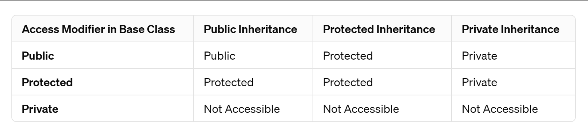

# Наследяване. Идея. Основни концепции.

- [x]  Inheritance vs composition
    - [x]  “is a” vs “has a”
        - [x]  derived ↔ base
        - [x]  child ↔ parent
- [x]  public, private + protected
    - [x]  in the fields
    - [x]  in the inheritance
- [x]  What’s visible, what’s not
- [x]  Downcasting + upcasting
    


**Кодът, който разглеждахме на семинара**
```c++
#include <iostream>
#include <vector>
using namespace std;

class Animal {
public:

	void displayInfo() const {
		cout << "name: " << name << endl;
		cout << "age: " << age << endl;
	}

	void setName(std::string newName) {
		if (newName.empty()) {
			throw std::invalid_argument("Name cannot be empty.");
		}

		this->name = newName;
	}

	void setAge(int newAge) {
		if (newAge < 0) {
			throw std::invalid_argument("Age cannot be negative.");
		}

		this->age = newAge;
	}

	Animal(std::string name, int age) {
		setName(name);
		setAge(age);

		cout << "Animal ctor" << endl;
	}

	Animal(const Animal& other) {
		cout << "Animal copy ctor" << endl;
	}

	~Animal() {
		cout << "Animal destructor" << endl;
	}

protected:
	//void setName(std::string newName);
	//void setAge(int newAge);

	std::string name;
private:
	int age;
};

class Dog : public Animal {
public:
	void displayInfo() {
		Animal::displayInfo();
		cout << "breed: " << breed << endl;
	}

	void bark() const {
		std::cout << name << " says Woof!" << std::endl;
	}

	Dog(std::string name, int age, std::string breed) : Animal(name, age), breed(breed) {
		cout << "Dog ctor" << endl;
	}

	Dog(const Dog& other) :Animal(other) {
		cout << "Dog  copy ctor" << endl;
	}

	~Dog() {
		cout << "Dog destructor" << endl;
	}
private:
	std::string breed;
};

void displayAnimal(Animal* animal) {
	animal->displayInfo();
}

void displayDog(Dog* dog) {
	dog->displayInfo();
}

int main()
{
	Dog dog = Dog("F", 1, "f2");
	Dog dog2 = dog;

	Animal* animal = new Dog("abc", 2,"a");
	Dog* dog3 = dynamic_cast<Dog*>(animal); // Only possible if Animal has at least one virtual function.
	
	if (dog3 == nullptr) {
		
	}

	//Animal* birdy = new Animal("G.I. Joe the pigeon", 6);
	//Dog* fluffy = new Dog("Fluffy", 10, "Pomeranian");

	//displayDog(fluffy);
	//std::cout << endl;
	//displayAnimal(birdy);
	//std::cout << endl;
	////displayDog((Dog*)birdy);
	//cout << endl;
	//displayAnimal((Animal*)fluffy);

	// >>> Very short intro to vector.
	//std::vector<int> numbers;
	//numbers.push_back(1);
	//numbers.push_back(2);
	//numbers.push_back(3);
	//numbers.push_back(4);

	//for (const int& num : numbers)
	//{
	//	cout << num << " ";
	//}
	//std::cout << endl;

	//for (auto it = numbers.begin(); it != numbers.end(); it++) {
	//	cout << " " << *it << endl;
	//}

	//Animal a = Dog("Slicky", 2, "Husky");
	//displayDog((Dog*)&a);
}

```