# Структури. Разположение в паметта. Битови полета. Разделна компилация.

> Колиствените натрупвания водят до качествени изменения.
>
> &mdash; Георг Вилхелм Фридрих Хегел

## Съдържание на темата


## Въведение

В началото нещата, за които говорим най-вероятно ще са неясни, моят съвет е все пак да се прочетат, ще правят смисъл в ретроспекция.

Досега, по УП учихме как да създаваме променливи с типове от самия език - `int`, `double`, `bool`, `char` и т.н.

Фокусът ни от тук нататък е да да използваме тези типове и да ги надградим, като започнем да създаваме **наши типове**. 


Чрез добре измислени наши типове, имаме силата да моделираме отделните части на произволно сложен проблем и това как тези части си взаимодействат, това ще ни позволи да пишем четим, качествен код.

### Типове данни, дадени от езика

Tиповете данни, дадени от езика, са ни познати. Наричаме ги **primitive data types** и сме създавали не малко променливи с тях:

<small><b>Пример 1: Примитивни типове данни</b></small>

```c++
#include <iostream>

int main() {
    int number = 42; // <-- int
    int numbers[100] = {0}; // <-- array
    char initial = 'A'; // <-- char

    return 0;
}
```

### Типове данни, създадени от нас

Има и друга "категория" типове данни, те са типовете данни, които ние можем да денифинираме. Вече сме виждали енумерациите(`enum`), които спадат в тази категория.

<small><b>Пример 2: Енумерация - дефиниране, инстанциране и сравнение</b></small>

```c++
#include <iostream>

enum DayOfWeek {
	Monday = 0,
	Tuesday = 1,
	Wednesday = 2,
	Thursday = 3,
	Friday = 4,
	Saturday = 5,
	Sunday = 6,

};

int main() {
	DayOfWeek today = Monday; // <-- DayOfWeek, defined by us.

	if (today == Saturday || today == Sunday) {
		std::cout << "It's the weekend!";
	}
	else {
		std::cout << "It's a weekday.";
	}

	return 0;
}

```

<br/>

Структурите (`struct`) които ще разглеждаме този урок също спадат в тази категория на типове, които ние дефинираме.

---

## Структури

Целта на една структура е да групира концептуално даден набор от данни.

Ако трябва да моделираме точка от двумерното пространство чрез код, бихме направили променливи `pointX` и `pointY`.
Структурите ни позволяват да обединим тези промениви в наш собствен тип, който можем да наречем `Point`, който групира `x` и `y`.

TODO: Update, не се разбира, също добави title
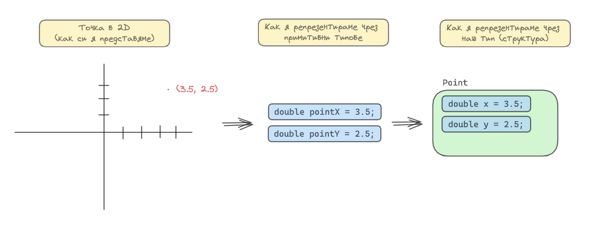


<small><b>Пример 3: Структура - дефиниране, инстанциране и достъп до **полета(fields)** </b></small>

```c++
#include <iostream>

struct Point {
    double x;
    double y;
};

void printPoint(Point p);

int main() {
    Point point = { 3.5, 2.5 };

    printPoint(point);

    return 0;
}

void printPoint(Point p) {
    std::cout << "Point coordinates: (" << p.x << ", " << p.y << ")" << std::endl;
}
```

Дефинираните в `Point`, `x` и `y`, отсега нататък ще наричаме **полета**.

Имайки този нов тип `Point`, вече можем да го използваме като всеки друг тип, например във функцията `printPoint`, той е параметър, в картинката по-долу са показани разликите:
 1. Декларацията на функцията се промени, вместо 2 параметъра `x` и `y`, очаква само един от тип `Point` на име `p`.
 2. Самата имплементация също се променя, за да достъпим стойностите на `x` и `y`, които вече са част от структурата `Point`, трябва да използваме "оператор точка" на самата инстанция `p` --> `p.x`, `p.y`.

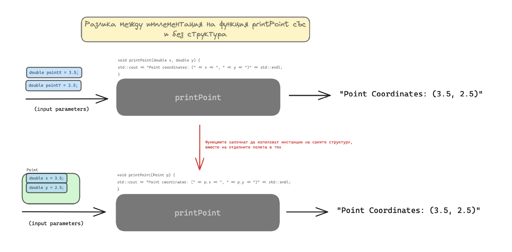

### Операции със структури
Ще разгледаме различни операции със структури, за пример ще използваме структурата `Student`.

Нека да решим следната задача:

<small><b>Задача 1: структура `Student` </b></small>
Създайте програма на C++, която дефинира структура `Student`, съдържаща следните полета: 
 1. име (низ с дължина до 100 символа),
 2. факултетен номер (целочислен тип) и 
 3. среден успех (десетично число). 
 
Програмата трябва да извършва следните стъпки:

1. Дефинирайте структурата `Student`.
2. Инстанцирайте обект от тип `Student`, като прочетете от конзолата името, факултетния номер и средния успех на студента.
3. Напишете функция `updateGPA`, която приема обект от тип `Student` по референция и променя неговия среден успех, като също прочетете новата стойност от конзолата.
4. Напишете функция `printStudent`, която приема обект от тип `Student` и отпечатва информация за студента в конзолата.
5. В `main` функцията, след като инстанцирате и модифицирате обекта `Student`, извикайте `printStudent`, за да отпечатате актуализираната информация за студента.


 - дефиниране
 - инстанциране
 - промяна на полета, четене от конзола
 - подаване на фукнция
 - връщане от функция
 -  

#### 1. Дефиниране на структура
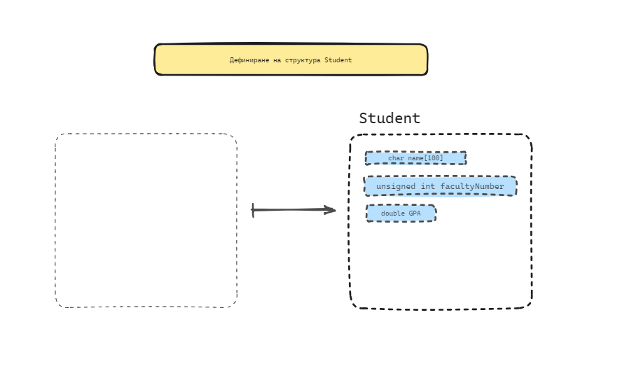
Преди да можем да създаваме променливи от тип `Student`, трябва да дефинираме този тип.

За да го дефинираме:
 1. Използваме ключовата дума `struct`,
 2. последвана от името на структурата, в случая `Student`
 3. в къдрави скоби дефинираме отделните полета на структурата, по същия начин както дефинираме променливи
 4. Не забравяме да добавим `;` след затварящата къдрава скоба

<small><b>Пример х: Дефиниране на структура `Student`</b></small>
```c++
#include <iostream>

struct Student { // <----
	char name[100];
	unsigned int facultyNumber;
	double gradePointAverage; // GPA.
};

int main() {

	return 0;
}

```

##### Какво са полета?
Полетата в една структура са отделните компоненти, които тя обединява. В случая `name`, `facultyNumber` и `gradePointAverage` са полета, които структурата `Student` обединява заедно.

#### 2а. Инстанциране на обект от тип `Student`
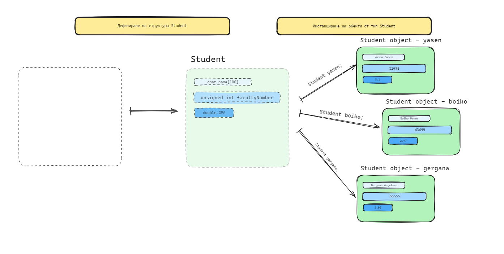
Имайки вече дефинирам типа `Student`, можем да започнем да създаваме променливи от този тип. 
Това действие наричаме "инстанциране на обект от тип `Student`" или "създаване на обект от тип `Student`", къде обектите са различните променливи от този тип.

<small><b>Пример х: Създаване на обект от тип `Student`</b></small>
```c++
#include <iostream>

struct Student {
	char name[100];
	unsigned int facultyNumber;
	double gradePointAverage; // GPA.
};

int main() {
	Student student; // <----

	return 0;
}
```

Създаваме обект от тип `Student`, както бихме създали променлива - `Student student`.

C++ автоматично заделя памет за обекта `student` и дава случайните стойности на тези адреси в паметта на отделните полета. Затова е много важно преди да използваме даден обект да въведен правилни данни в него.

<small><b>Пример х: Случайните стойности на полетата за обект от тип `Student` при създаването му</b></small>
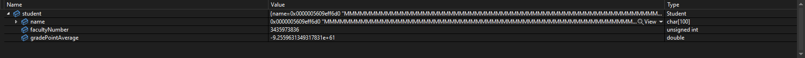

#### 2b. Четене на данни за обект от тип `Student` от конзолата
Работим по абсолютно същия начин както бихме разботили с трите променливи `name`, `facultyNumber` и `gradePointAverage`, единствената разлика е, че за да ги достъпим, трябва да използваме обектът `student` и оператор точка - `student.name`, `student.facultyNumber` и `student.gradePointAverage`.


```c++
#include <iostream>

using namespace std;

struct Student {
	char name[100];
	unsigned int facultyNumber;
	double gradePointAverage; // GPA.
};

int main() {
	Student student;

	cout << "Please enter up to 100 characters for your name:" << endl;
	cin.getline(student.name, 100);

	cout << "Please enter your faculty number:" << endl;
	cin >> student.facultyNumber;

	cout << "Please enter your grade point average:" << endl;	
	cin >> student.gradePointAverage;

	return 0;
}

```
<small><b>Пример х: Стойности на полетата за обекта `student` след четене от конзолата</b></small>
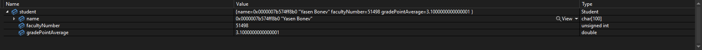

#### 3. Декларираме и дефиниране на функция, която приема обект от тип `Student` и го променя
Можем да създаваме функции, които приемат параметри от тип `Student`. В зависимост от това дали искаме да запазим промените, които сме направили в дадената функция или не, можем да изберем да приемаме параметрите по референция(`Student& student`) или по стойност(`Student student`). 

```c++
#include <iostream>

using namespace std;

struct Student {
	char name[100];
	unsigned int facultyNumber;
	double gradePointAverage; // GPA.
};

void updateGPA(Student& student); // Function declaration.

int main() {
	Student student;

	cout << "Please enter up to 100 characters for your name:" << endl;
	cin.getline(student.name, 100);

	cout << "Please enter your faculty number:" << endl;
	cin >> student.facultyNumber;

	cout << "Please enter your grade point average:" << endl;
	cin >> student.gradePointAverage;

	updateGPA(student);

	return 0;
}


void updateGPA(Student& student) { // Function definition.
	double newGPA;

	cout << "Please enter your new GPA:" << endl;
	cin >> newGPA;

	student.gradePointAverage = newGPA;
}
```

#### 4. Декларираме и дефиниране на функция, която приема обект от тип `Student` и не го променя
Знаем че функцията `printStudent`, която трябва да напишем, няма да променя параметъра `student`, затова параметъра задаваме като `const Student& student`,
подаваме го по референция `Student&`, за да не правим излишни копирация и го правим константен `const Student`, за да не можем да го променим.

```c++

#include <iostream>

using namespace std;

struct Student {
	char name[100];
	unsigned int facultyNumber;
	double gradePointAverage; // GPA.
};

void printStudent(const Student& student);

int main() {
	Student student;

        // ...read input from console and update GPA.

	printStudent(student);

	return 0;
}

void printStudent(const Student& student) {
	cout << "Student information below." << endl;
	cout << "Name: " << student.name << endl;
	cout << "Faculty number: " << student.facultyNumber << endl;
	cout << "GPA: " << student.gradePointAverage << endl;
}
```

#### 5. Пълното решение на задачата

```c++
#include <iostream>

using namespace std;

struct Student {
	char name[100];
	unsigned int facultyNumber;
	double gradePointAverage; // GPA.
};

void updateGPA(Student& student);
void printStudent(const Student& student);

int main() {
	Student student;

	cout << "Please enter up to 100 characters for your name:" << endl;
	cin.getline(student.name, 100);

	cout << "Please enter your faculty number:" << endl;
	cin >> student.facultyNumber;

	cout << "Please enter your grade point average:" << endl;
	cin >> student.gradePointAverage;

	updateGPA(student);
	printStudent(student);

	return 0;
}

void updateGPA(Student& student) {
	double newGPA;

	cout << "Please enter your new GPA:" << endl;
	cin >> newGPA;

	student.gradePointAverage = newGPA;
}

void printStudent(const Student& student) {
	cout << "Student information below." << endl;
	cout << "Name: " << student.name << endl;
	cout << "Faculty number: " << student.facultyNumber << endl;
	cout << "GPA: " << student.gradePointAverage << endl;
}
```

#### 6. Добри практики. Подобрение на кода.
Текущото решение има 2 основни пропуска:
1. Има магически числа(magic numbers) за максималния размер на `name` - винаги изкарваме магическите числа в константи
2. Кодът в `main()` не се чете лесно, тъй като правим запълването на данни от конзолата в него - изнасяме свързаните блокове код в отделни функции и ги използваме, дори да ни трябват само веднъж

```c++
#include <iostream>

using namespace std;

const int MAX_NAME_LENGTH = 100;

struct Student {
	char name[MAX_NAME_LENGTH];
	unsigned int facultyNumber;
	double gradePointAverage; // GPA.
};

void readStudentFromConsole(Student& student);
void updateGPA(Student& student);
void printStudent(const Student& student);

int main() {
	Student student;

	readStudentFromConsole(student);
	updateGPA(student);
	printStudent(student);

	return 0;
}
void readStudentFromConsole(Student& student) {
	cout << "Please enter up to " << MAX_NAME_LENGTH << " characters for your name : " << endl;
	cin.getline(student.name, MAX_NAME_LENGTH);

	cout << "Please enter your faculty number:" << endl;
	cin >> student.facultyNumber;

	cout << "Please enter your grade point average:" << endl;
	cin >> student.gradePointAverage;
}

void updateGPA(Student& student) {
	double newGPA;

	cout << "Please enter your new GPA:" << endl;
	cin >> newGPA;

	student.gradePointAverage = newGPA;
}

void printStudent(const Student& student) {
	cout << "Student information below." << endl;
	cout << "Name: " << student.name << endl;
	cout << "Faculty number: " << student.facultyNumber << endl;
	cout << "GPA: " << student.gradePointAverage << endl;
}
```

##### Подобрения
1. Вече кодът в `main()` метода се чете като текст на аглийски:
    1. Създай студент
     2. Прочети го от конзолата
    3. Промени му оценката
    4. Принтирай го на конзолата

2. При нужда от промяна на размера на масива `name`, промяната се случва само на едно място, в `MAX_NAME_LENGTH` и всичката останала част от кода работи както трябва, включително и `cout` съобщението към потребителя на нашата програма.

##### В какви случаи са полезни - кога се сещаме да ги използваме
Едно от предизвикателствата, пред което сме представени когато работим по реален проект е неяснотата. Често се случва да не е добре описано какво се очаква от нас да направим и то най-вече описано от гледна точка на потребителя на нашето приложение, с други думи наша е задачата да разберем какъв проблем трябва да бъде решен, да го моделираме най-добре и да го решим.

Структурите влизат в употреба когато имаме имаме дадени данни, които искаме да групираме, това ще направи кода ни по-четим и лесен за разбиране.

---

## Задачи за структури

TODO: Задачи за структури

---

## Разположение на структурите в паметта при създаване на обекти
Когато стартираме нашата програма, операционната система заделя част от RAM паметта, която имаме на нашата машина. 

Можем да си представим, че нашата рам памет е една много дълга редица от байтове, от която заделяме дадена част при изпълнението на нашата програма.
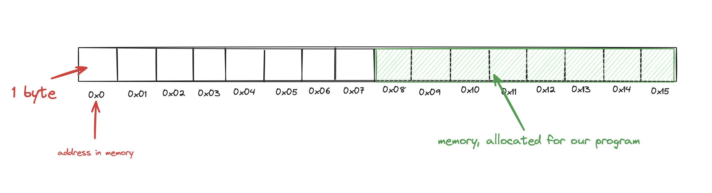

### Как променливи от примитивни типове са разположение в паметта

Засега знаем, че обикновено:
 1. `bool` заема 1 байт
 2. `char` заема 1 байт
 3. `int` заема 4 байта
 4. `double` заема 8 байта

```c++
#include <iostream>
using namespace std;

int main() {
    bool myBool = true;         
    char myChar = 'A';          
    int myInt = 123;            
    double myDouble = 123.456; 

    return 0;
}

```

Примерно заделяне на паметта може да изглежда така. 

TODO: title
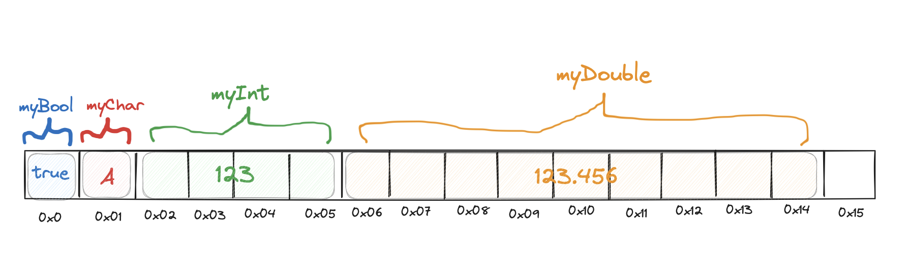

Не е задължително променливите да са една до друга в паметта. Може да бъде разположено и така.

TODO: title
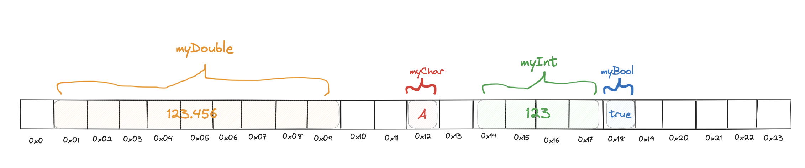

### Как обекти от тип структура дефинирана от нас са разположени в паметта
Когато създаваме обект от даден тип структура, самият обект заема място в паметта по строго определени правила. Знаейки тези правила, можем да дефинираме оптимални структури.

Нека разгледаме следната структура:

todo:title
```c++
#include <iostream>

struct WeatherData {
    char temperatureCategory; // Category code for the temperature ('H' for hot, 'C' for cold, 'M' for moderate)
    char condition; // Condition code ('S' for sunny, 'R' for rainy, 'C' for cloudy, 'W' for windy)
    double temperatureInCelsius; // Temperature reading in degrees Celsius
    int timestamp; // Unix timestamp representing the date and time of the reading
};

int main() {
    WeatherData currentWeather = {'M', 'S', 22.5, 1617123456};

    return 0;
}
```

Потелнциална първичната идея за разпределение в паметта на обекта `currentWeather` от тип `WeatherData`, би била:

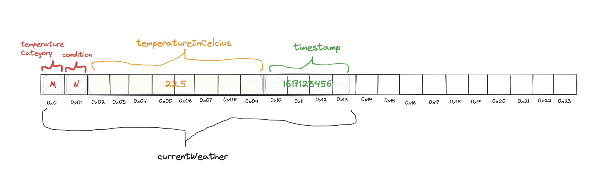

Тази идея е грешна поради следното правило

### Изисквания за подравняване за структури (Alignment requirements)
За оптимален достъп от операционната система, всяко едно от полетата на дадена структура **изискват да са подравнени на адрес кратен на размера на типа на даденото поле**.

<small><b>integers - 4 байта</b></small>
Това означава, че полето `timestamp`, може да започва само на адреси кратни на 4, тъй като обикновено `int` заема 4 байта в паметта. Тоест, `0x0`, `0x4`, `0x8`, `0x12` и т.н.

<small><b>chars and booleans - 1 байт</b></small>
Това важи за всяко едно поле на структурата. Обикнове с типове като `bool` и `char` нямаме проблем, тъй като те обикновено са заемат 1 байт, което означава че могат да започват на всеки адрес - `0x0`, `0x1`, `0x2`, `0x3` и т.н.

<small><b>double - 8 байта</b></small>
Както останалите типове, `double` също има свойте изисквания за подравняване, кратни на 8 - `0x0`, `0x8`, `0x16`, `0x24` и т.н.

Тъй като double има най-специфични изисквания, всички останалите полета се нареждат по него. 

Компилаторът подпълна обекта с празни байтове:

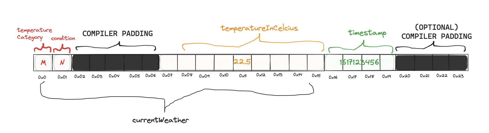

1. `temperatureCategory` е с размер 1, затова може на всеки адрес кратен на 1, т.е всеки адрес
2. Същото важи за `condition`
3. `temperatureInCelcius` e `double`, може на всеки адрес кратен на 8, първият такъв в случая е `0x8`
4. `timestamp` е `int`, може на всеки адрес кратен на 4, първият такъв в случая е `0x16`, непосредствено след `temperatureInCelcius`
5. Компилаторът на C++ подпълва паметта от `0x2` до `0x6` с празни байтове, за да изпълни изискванията на `double temperatureInCelcius`
6. Възможно е да има и padding за последните 4 байта, от `0x20` до `0x23`. Този padding се добавя когато имаме масив от обекти на дадената структура, за да има и подравняване между елементите на самия масив.

Един обект от структурата заема общо 24 байта в паметта.

### Как да създаване структури оптимални по памет
**Слагаме полетата с най-специфични изисквания в началото на структурата.**

Дали полето е масив или не няма значение, интересуваме се само от типа. 

Указателите са отделен тип и те заемат 4 или 8 байта, в зависимост от операционната система(32 или 64 битова).

todo: title (подобрена weatherdata структура)

```c++
struct WeatherData {
    double temperatureInCelsius; // Temperature reading in degrees Celsius
    int timestamp;               // Unix timestamp for the date and time of the reading
    char temperatureCategory;    // Category code for the temperature ('H', 'C', 'M')
    char condition;              // Condition code ('S', 'R', 'C', 'W')
    // Потенциално добавяне на padding тук, за да гарантираме подравняване
};
```

Съотвеното заделяне на памет вече е:
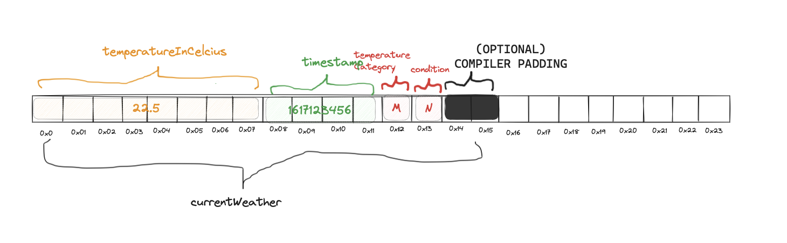

1. `temperatureInCelcius` e `double`, може на всеки адрес кратен на 8, първият такъв в случая е `0x0`
2. `timestamp` е `int`, може на всеки адрес кратен на 4, първият такъв в случая е `0x8`, непосредствено след `temperatureInCelcius`
3. `temperatureCategory` е с размер 1, затова може на всеки адрес кратен на 1, т.е всеки адрес, затова заема непосредствено `0x12`
4. Същото важи за `condition` - `0x13`
5. Възможно е да има и padding за последните 2 байта, от `0x14` и `0x15`. Този padding се добавя когато имаме масив от обекти на дадената структура, за да има и подравняване между елементите на самия масив.

Обект от тази структура вече заема максимално 16 байта в паметта.

---

## Задачи за разположение на структируте в паметта

TODO: Задачи за задачи за разположение на структируте в паметта

---

## Битови полета
TODO: Bit fields

---

## Задачи за Битови полета

TODO: Задачи за Битови полета

---

## Разделна компилация. Използване на отделни файлове за смислово разграничение

В практиката едно от най-големите предизвикателства е сложността, която се получава от самите мащаби на кода, който пишем. Дадени проекти могат да достигнат стотици хиляди, милиони редове код.

В по-малки мащаби имаме опит с решението на този проблем - функции. Те ни позволяват да разделяме кода си на отделни части и да мислим за тях по отделно, а след това да ги комбинираме, за да решаваме по-сложни проблеми.

Следващата стъпка е да започнем да разделяме кода си не само на функции, а и на повече от един файл.

Какво слагаме в отделните файлове? Различните структури и функции свързани с тях.
todo: title
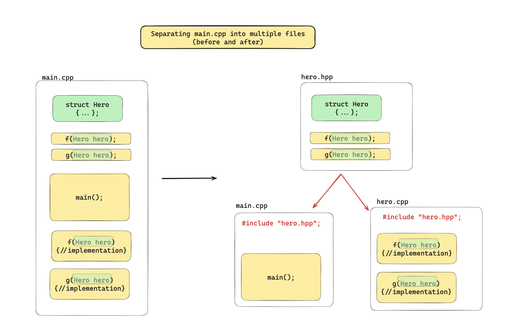

### Създаване и смисъл на Header файл (.hpp)
TODO: 

#### Header guards

```c++
#ifndef _HERO_HEADER_INCLUDED_
#define _HERO_HEADER_INCLUDED_

// ...code

#endif
```

### Създаване и смисъл на Source code файл (.cpp)
TODO: 

### Разделна компилация
TODO: 


 - hpp files -> C++ header files - contain declarations and definitions of structs, functions
 - cpp files -> C++ source files -> contain function definitions
 - hpp files have guards and are imported
 - cpp files only import hpp files
 - 1 file combo per struct

### Въпроси

- Какво са структурите?
- С какво те са полезни?
- Какво е тяхното приложение в практиката?
- въпроси за добри практики

- Какво е декларация на функция?
- Какво е дефиниция на функция?
- Какво е инстанция на структура?
- Какво е обект?
- Какво е поле на структура?
- Какво е инициализиращ списък?(initializer list)

- Направете структура `Address`, която включва отделни полета за държава, град, улица, блок + вход + етаж. + четене от конзола + писане в конзола, сравняване на 2 адреса дали са еднакви.

- ** Въпроси, чиито отговори не са в текста по-горе **
- \*\* Задача със структура в структурата


---
# Task list

TODO: spell check.
TODO: Добри практики

- дефиниране на структури в отделни файлове, excalidraw this + the include in vs
- 1 file - 1 class, 1 struct - folder structure should convey what the codebase contains clearly. There are cases where you can break this convention, for now follow it.
- define guards for double inclusion

TODO: theory practice questions
TODO: Simple tasks for understanding the syntax

- create struct
- print struct
- create a method inside the struct
- create a function that accepts the struct
- some

TODO: задачи + решения

TODO: Possibly? Show operator overload, first do it with a method add for example. Operator overload for <>?
TODO: намали размера на снимките с chatGPT
TODO: user input validation.


- масив от структури
- структура с масиви - окей, но без динамична памет
  TODO: Пример за char[] в структура


TODO: Кога използваме структури?
TODO: array vs struct
TODO: array of struct
TODO: array of structs with nested structs
TODO: Nesting structures: Triangle -> area, perimeter,

example for showing useful structs -> array of points, function that prints them, function that finds the furthest point from the center
todo: nail & hammer metaphor for oop forward and the modelling part -> read problem statement -> model the problem through user defined types - enum + struct, etc. (no dynamic memory, that's for classes)

todo: modelling part -> bad naming of Point -> Point2D, Point3D
