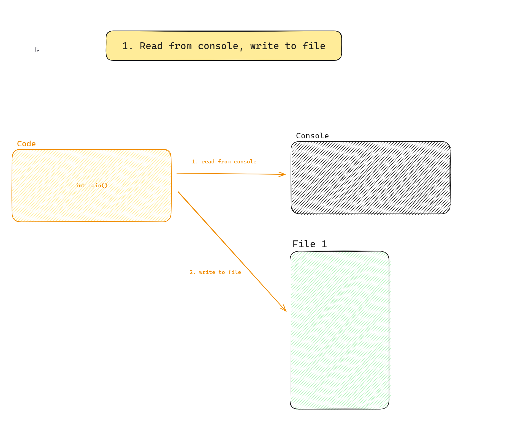

# Файлове - основни концепции. Текстови файлове. Преглед на fstream

# Задачи

## 1. Дневник
Напишете програма на C++, която позволята на потребителя да си води дневник през меню на конзолата. Крайния резултат на задачата е менюто отдолу. 
Следват редица задачи, които постепенно ще достигнат до крайния резултат.

**Всички решения по-долу имат цялата програма до момента и коментари за всеки нов добавен код от текущата задача.**

| Опция              | Описание                                                                                                                     |
|-------------------|------------------------------------------------------------------------------------------------------------------------------|
| 1. Add new entry  | Позволява на потребителя да въведе нов дневников запис, който ще бъде добавен към съществуващите записи, запазвайки предишното съдържание.  |
| 2. Show all entries | Показва всички записи, съхранени в дневника, позволявайки на потребителя да прегледа предишните си записи.                     |
| 3. Edit entry | Предоставя функционалност за редактиране на съществуващ запис. Тази опция обикновено изисква потребителя да избере кой запис да редактира, чрез подаване на уникален идентификатор (id). |
| 4. Delete entry | Позволява изтриването на конкретен запис, потребителят посочва уникалния идентификатор (id) на записа, които да бъде изтрит    |
| 5. Search for entry | Позволява на потребителите да намерят записи въз основа на зададени критерии, като дата или етикети, улеснявайки достъпа до свързаните дневнични записи. |
| 6. Show all entries count | Позволява на потребителите да провери колко общо записа има в дневника |
| 7. Delete all entries | Предоставя опция за изчистване на дневника чрез премахване на всички записи |
| 8. Exit             | Затваря приложението безопасно, като се осигурява, че всички данни са запазени и ресурсите са правилно освободени.           |

### 1a. Писане във файл

<small><b>Tags: [Open file], [Validate file], [Write to file], [Close file][Read from console]</b></small>


Напишете програма, която:
1. Отваря файл с име `diary.txt`
2. Проверява дали е отворила файлът успешно
	2а. Ако не, програмата приклюва след показване на грешка в конзолата
3. Пита потребителя за текст от конзолата, които ще представлява новия запис в дневника
4. Записва този текст във файла
5. Затваря файла.

<details>
<summary>Отговор. Моля, първо реши задачата преди да гледаш решението.</summary>

```c++
#include <iostream>
#include <fstream>

// 1. Define constansts.
const char* DIARY_FILE_NAME = "diary.txt"; // 1a. Useful when creating streams in multiple places or you need the file name for console logging.
const size_t MAX_DIARY_LINE_LENGTH = 256 + 1; // 1b. We set our max line length to 256 and add 1 for the terminating zero.

int main()
{
	// 2. Create an output file stream for writing to the diary text file.
	std::ofstream diaryTextStream = std::ofstream(DIARY_FILE_NAME);

	// 3. Always check if the stream to the file was successfully open. Terminate the application if fail here.
	// 3a. Use std::cerr for logging errors to the console.
	// 3b. Use "!diaryTextStream.is_open()" and terminate early if there is an error instead of "diaryTextStream.is_open()" and adding the whole happy path code in the if statement.
	if (!diaryTextStream.is_open())
	{
		std::cerr << "Terminating application. Couldn't open " << DIARY_FILE_NAME << std::endl;
	}

	// 4. Read the new diary entry from the console.
	char diaryEntry[MAX_DIARY_LINE_LENGTH];
	std::cout << "Please enter a diary entry up to " << MAX_DIARY_LINE_LENGTH - 1 << " characters:" << std::endl;
	std::cin.getline(diaryEntry, MAX_DIARY_LINE_LENGTH);

	// 5. Write the diary entry to the text file. The same way we'd write to the console, now we just don't use cout.
	diaryTextStream << diaryEntry << std::endl;

	// 6. Inform the user that the action was successful.
	std::cout << "Added diary entry to the diary." << std::endl;

	// 7. Always close file streams to inform the operating system that the resource is free.
	diaryTextStream.close();

	return 0;
}

```
</details>

### 1b. Потребителско меню

Допълнете програмата от **1a**, като добавите меню с две опции:
1. Add new entry - позволява на потребителя на въведете нов запис в дневника
2. Exit - Позволява на потребителя да прекрати програмата

<details>
<summary>Отговор. Моля, първо реши задачата преди да гледаш решението.</summary>

```c++
#include <iostream>
#include <fstream>

// 1. Use only the most common resources from std, instead of 'using namespace std;' as it is a bad practice. Might lead to issues. Read more about it!
using std::cin;
using std::cout;
using std::cerr;
using std::endl;

const char* DIARY_FILE_NAME = "diary.txt"; 
const size_t MAX_DIARY_LINE_LENGTH = 256 + 1; 

// 2. Define an enum class to hold all our operations on the diary.
// 2a. Include Invalid operation as -1 to have a default value and convey invalid state to the rest of the application.
enum class DiaryOperation
{
	InvalidOperation = -1,
	AddNewEntry = 1,
	Exit = 2
};

// 3. Separate menu header and body into two in order to reuse the menu body in the do while loop.
void printUserMenuHeader();
void printUserMenuBody();

// 4. Move the code from task 1a to a method and use it in the switch case below.
void addNewDiaryEntry();

int main()
{
	// Create one int for the user choice from the console and then convert it to the DiaryOperation enum to write better code.
	// We do this because we then we can use the strongly types enum class instead of having random integers in the app.
	unsigned short int userChoice;
	DiaryOperation operation = DiaryOperation::InvalidOperation;

	printUserMenuHeader();
	do {
		printUserMenuBody();

		cin >> userChoice;
		// 5. Discard any empty white lines or new lines after we read the user input. We do this because if we cin.getline without ignore we might only read an end line instead of the user input.
		cin.ignore();

		// 6. Cast the int to our DiaryOperation enum.
		operation = static_cast<DiaryOperation>(userChoice);
		switch (operation)
		{
		case DiaryOperation::AddNewEntry:
			addNewDiaryEntry();
			break;
		case DiaryOperation::InvalidOperation:
			cout << "Invalid operation. Please try selecting operation from the menu." << endl;
			break;
		case DiaryOperation::Exit:
			cout << "Exit. Terminating application. Thank you for using Personal Diary!" << endl;
			break;
		default:
			break;
		}
	} while (operation != DiaryOperation::Exit);

	return 0;
}

void addNewDiaryEntry()
{
	std::ofstream diaryTextStream = std::ofstream(DIARY_FILE_NAME);

	if (!diaryTextStream.is_open())
	{
		cerr << "> Couldn't open " << DIARY_FILE_NAME << ". Please try again or try a different operation." << endl;
		return;
	}

	char diaryEntry[MAX_DIARY_LINE_LENGTH];
	cout << "> Please enter a diary entry up to " << MAX_DIARY_LINE_LENGTH - 1 << " characters:" << endl;
	cin.getline(diaryEntry, MAX_DIARY_LINE_LENGTH);

	diaryTextStream << diaryEntry << endl;

	cout << "> Added diary entry to the diary." << endl << endl;

	diaryTextStream.close();
}

void printUserMenuHeader()
{
	cout << "Welcome to Personal Diary. What would you like to do today?" << endl;
}


void printUserMenuBody()
{
	cout << "1. Create new entry" << endl;
	cout << "2. Exit" << endl;
	cout << "Enter your choice (1-2): ";
}


```
</details>

### 1c. Писане във файл без изтриване на файла
<small><b>Tags: [Open file], [Validate file], [Write to file], [Append new content], [Close file]</b></small>

Един проблем, които има приложението в момента, е че добавянето на нов запис изтрива предишните. Променете програмата, така че добавянето на нов запис добавя нов ред в края на файла.

<details>
<summary>Отговор. Моля, първо реши задачата преди да гледаш решението.</summary>

Единствената разлика е добавяне на `append` флага при отваряне на поток към файла.

<small><b>ofstream, който изтрива съдържанието на файла при отваряне</b></small>

```c++
	std::ofstream diaryTextStream = std::ofstream(DIARY_FILE_NAME);
```

<small><b>ofstream, който не изтрива съдържанието на файла и добавя към края му</b></small>

```c++
	std::ofstream diaryTextStream = std::ofstream(DIARY_FILE_NAME, std::ios_base::app);

```
</details>

### 1d. Четене от файл
<small><b>Tags: [Open file], [Validate file], [Read from file], [Close file][Write to console]</b></small>


Добавете нова операция `Show all entries`, която след като бъде селектирана, показва всички записи в `diary.txt`.


<details>
<summary>Отговор. Моля, първо реши задачата преди да гледаш решението.</summary>

```c++
#include <iostream>
#include <fstream>

using std::cin;
using std::cout;
using std::cerr;
using std::endl;

const char* DIARY_FILE_NAME = "diary.txt";
const size_t MAX_DIARY_LINE_LENGTH = 256 + 1;

enum class DiaryOperation
{
	InvalidOperation = -1,
	AddNewEntry = 1,
	// 1. Add new enum value for the new operation.
	ListAllEntries = 2,
	Exit = 3
};

void printUserMenuHeader();
void printUserMenuBody();

void addNewDiaryEntry();

// 2. Add new method to read from the file and print to the console.
void listAllEntries();

int main()
{
	unsigned short int userChoice;
	DiaryOperation operation = DiaryOperation::InvalidOperation;

	printUserMenuHeader();
	do {
		printUserMenuBody();

		cin >> userChoice;
		cin.ignore();

		operation = static_cast<DiaryOperation>(userChoice);
		switch (operation)
		{
		case DiaryOperation::AddNewEntry:
			addNewDiaryEntry();
			break;
		// 3. Add new switch case with the new enum value and use the new method.
		case DiaryOperation::ListAllEntries:
			listAllEntries();
			break;
		case DiaryOperation::InvalidOperation:
			cout << "Invalid operation. Please try selecting operation from the menu." << endl;
			break;
		case DiaryOperation::Exit:
			cout << "Exit. Terminating application. Thank you for using Personal Diary!" << endl;
			break;
		default:
			break;
		}
	} while (operation != DiaryOperation::Exit);

	return 0;
}

void listAllEntries()
{
	// 4. Use ifstream (input file stream) to now read from file. Think cin for files instead for console.
	std::ifstream diaryTextInStream = std::ifstream(DIARY_FILE_NAME);

	// 5. As with ofstreams, when creating a stream to a file, always check if the file was open successfully.
	if (!diaryTextInStream.is_open())
	{
		cerr << "> Couldn't open " << DIARY_FILE_NAME << ". Please try again or try a different operation." << endl;
		return;
	}

	// 6. Create a char array that we'll use to get each line from the file. Use the max line length we've defined.
	char line[MAX_DIARY_LINE_LENGTH];

	// 7. Technique for reading a file line by line - use getline in a while loop. It terminates automatically when the getline function reaches the end of the file.
	while (diaryTextInStream.getline(line, MAX_DIARY_LINE_LENGTH))
	{
		// 8. Print the line from the file to the console for the user.
		cout << "> " << line << endl;
	}

	cout << endl;
}

void addNewDiaryEntry()
{
	std::ofstream diaryTextOutStream = std::ofstream(DIARY_FILE_NAME, std::ios_base::app);

	if (!diaryTextOutStream.is_open())
	{
		cerr << "> Couldn't open " << DIARY_FILE_NAME << ". Please try again or try a different operation." << endl;
		return;
	}

	char diaryEntry[MAX_DIARY_LINE_LENGTH];
	cout << "> Please enter a diary entry up to " << MAX_DIARY_LINE_LENGTH - 1 << " characters:" << endl;
	cin.getline(diaryEntry, MAX_DIARY_LINE_LENGTH);

	diaryTextOutStream << diaryEntry << endl;

	cout << "> Added diary entry to the diary." << endl << endl;

	diaryTextOutStream.close();
}

void printUserMenuHeader()
{
	cout << "Welcome to Personal Diary. What would you like to do today?" << endl;
}


void printUserMenuBody()
{
	cout << "1. Create new entry" << endl;
	// 9. Add new entry for the menu being printed.
	cout << "2. List all entries" << endl;
	cout << "3. Exit" << endl;
	cout << "Enter your choice (1-3): ";
}
```
</details>

### 1e. Добавяне на днешните дата и час към всеки нов запис

При изпълнението на опция `1. Add New Entry`, В началото на реда добавете текущата дата във следния формат `2024-03-30 18:58:12`.

Работа с дати и часове не е взиман материал, използвайте интернет, за да постигнете желания резултат.

<details>
<summary>Отговор. Моля, първо реши задачата преди да гледаш решението.</summary>

```c++
#include <iostream>
#include <fstream>
#include <ctime>

using std::cin;
using std::cout;
using std::cerr;
using std::endl;

const char* DIARY_FILE_NAME = "diary.txt";
const size_t MAX_DIARY_LINE_LENGTH = 256 + 1;

enum class DiaryOperation
{
	InvalidOperation = -1,
	AddNewEntry = 1,
	ListAllEntries = 2,
	Exit = 3
};

void printUserMenuHeader();
void printUserMenuBody();

void addNewDiaryEntry();

void listAllEntries();
// 1. Add new method to get current date. Use char* and buffer size to skip dynamic memory allocation.
void getCurrentDate(char* date, size_t bufferSize);

int main()
{
	unsigned short int userChoice;
	DiaryOperation operation = DiaryOperation::InvalidOperation;

	printUserMenuHeader();
	do {
		printUserMenuBody();

		cin >> userChoice;
		cin.ignore();

		operation = static_cast<DiaryOperation>(userChoice);
		switch (operation)
		{
		case DiaryOperation::AddNewEntry:
			addNewDiaryEntry();
			break;
			// 3. Add new switch case with the new enum value and use the new method.
		case DiaryOperation::ListAllEntries:
			listAllEntries();
			break;
		case DiaryOperation::InvalidOperation:
			cout << "Invalid operation. Please try selecting operation from the menu." << endl;
			break;
		case DiaryOperation::Exit:
			cout << "Exit. Terminating application. Thank you for using Personal Diary!" << endl;
			break;
		default:
			break;
		}
	} while (operation != DiaryOperation::Exit);

	return 0;
}

// 2. To get the current time, pass a char date[20] to this function.
void getCurrentDate(char* date, size_t bufferSize)
{
	// 2a. Get the current time
	std::time_t currentTime;
	std::time(&currentTime);

	// 2b. Convert the current time to a tm structure
	std::tm localTime;
	localtime_s(&localTime, &currentTime);

	// 2c. Format the date as a string
	std::strftime(date, bufferSize, "%Y-%m-%d %H:%M:%S", &localTime);
}

void listAllEntries()
{
	std::ifstream diaryTextInStream = std::ifstream(DIARY_FILE_NAME);

	if (!diaryTextInStream.is_open())
	{
		cerr << "> Couldn't open " << DIARY_FILE_NAME << ". Please try again or try a different operation." << endl;
		return;
	}

	char line[MAX_DIARY_LINE_LENGTH];

	while (diaryTextInStream.getline(line, MAX_DIARY_LINE_LENGTH))
	{
		cout << "> " << line << endl;
	}

	cout << endl;
}

void addNewDiaryEntry()
{
	std::ofstream diaryTextOutStream = std::ofstream(DIARY_FILE_NAME, std::ios_base::app);

	if (!diaryTextOutStream.is_open())
	{
		cerr << "> Couldn't open " << DIARY_FILE_NAME << ". Please try again or try a different operation." << endl;
		return;
	}

	// 3. Create a current date char array and fill it using the function.
	char currentDate[20];
	getCurrentDate(currentDate, sizeof(currentDate));
	char diaryEntry[MAX_DIARY_LINE_LENGTH];
	cout << "> Please enter a diary entry up to " << MAX_DIARY_LINE_LENGTH - 1 << " characters:" << endl;
	cin.getline(diaryEntry, MAX_DIARY_LINE_LENGTH);

	// 4. write the current date before the diary entry for each new entry.
	diaryTextOutStream << currentDate << " " << diaryEntry << endl;

	cout << "> Added diary entry to the diary." << endl << endl;

	diaryTextOutStream.close();
}

void printUserMenuHeader()
{
	cout << "Welcome to Personal Diary. What would you like to do today?" << endl;
}


void printUserMenuBody()
{
	cout << "1. Create new entry" << endl;
	cout << "2. List all entries" << endl;
	cout << "3. Exit" << endl;
	cout << "Enter your choice (1-3): ";
}
```
</details>

### 1f. Писане и четене от един файл. Добаваня на уникален идентификатор за всеки запис
<small><b>Tags: [Open file], [Validate file],[Read from file], [Write to file], [Append new content], [Close file]</b></small>

При изпълнението на опция `1. Add New Entry`, след всяка дата и час, добавете цяло положително число, което да е уникално за всеки нов запис.

При показване на записите в конзолата, за всеки ред също да се показва и уникалния идентификатор(id) в следния формат: `<date> <time> (id:<id>) <content>`

<details>
<summary>Отговор. Моля, първо реши задачата преди да гледаш решението.</summary>

```c++
#include <iostream>
#include <fstream>
#include <ctime>

using std::cin;
using std::cout;
using std::cerr;
using std::endl;

// 1. Add new constants, one for the file name that will contain the last maximum id - just an int, nothing else. and a constant for invalid id if operations fail.
const char* MAX_ID_FILE_NAME = "max_id.txt";
const int INVALID_ID = -1;
const char* DIARY_FILE_NAME = "diary.txt";
const size_t MAX_DIARY_LINE_LENGTH = 256 + 1;

enum class DiaryOperation
{
	InvalidOperation = -1,
	AddNewEntry = 1,
	ListAllEntries = 2,
	Exit = 3
};

void printUserMenuHeader();
void printUserMenuBody();

void addNewDiaryEntry();

void listAllEntries();
void getCurrentDate(char* date, size_t bufferSize);

// 2. Define a new function that will read from max_id.txt and get the next max id. Also when successfully read, it will write the next max id.
int getNextId();

int main()
{
	unsigned short int userChoice;
	DiaryOperation operation = DiaryOperation::InvalidOperation;

	printUserMenuHeader();
	do {
		printUserMenuBody();

		cin >> userChoice;
		cin.ignore();

		operation = static_cast<DiaryOperation>(userChoice);
		switch (operation)
		{
		case DiaryOperation::AddNewEntry:
			addNewDiaryEntry();
			break;
		case DiaryOperation::ListAllEntries:
			listAllEntries();
			break;
		case DiaryOperation::InvalidOperation:
			cout << "Invalid operation. Please try selecting operation from the menu." << endl;
			break;
		case DiaryOperation::Exit:
			cout << "Exit. Terminating application. Thank you for using Personal Diary!" << endl;
			break;
		default:
			break;
		}
	} while (operation != DiaryOperation::Exit);

	return 0;
}

int getNextId()
{
	// 3. Define an fstream (file stream) for read and write, using the ios::in and ios::out flags.
	std::fstream maxIdStream = std::fstream(MAX_ID_FILE_NAME, std::ios::in | std::ios::out);

	// 4. Again, check if it is successfully opened. Indicate error to the console and return the invalid id if opening failed.
	if (!maxIdStream.is_open())
	{
		cerr << "> Couldn't open " << MAX_ID_FILE_NAME << ". Please try again or try a different operation." << endl;
		return INVALID_ID;
	}

	// 5. Initialize the variable that will take the maxId from the file.
	int maxId = INVALID_ID;
	// 6. Read the integer value from the file into maxId.
	maxIdStream >> maxId;

	// 7. It's possible the read failed, so we have to explicitly check and terminate if it failed.
	if (maxIdStream.fail() && !maxIdStream.eof())
	{
		cerr << "Couldn't read max ID from " << MAX_ID_FILE_NAME << ". Please try again or try a different operation." << endl;
		return INVALID_ID;
	}

	// 8a. At this point in the code, we've successfully read the value, now we have to update it in the file.
	// To do that, we use clear(), which resets all flags that indicate reaching the of the file or some other issues the stream might have.
	// We do that because we cannot write to the file if any of those "bad" flags are true.
	// 8b. Use seekp(0) to go to the beginning of the file.
	maxIdStream.clear();
	maxIdStream.seekp(0);

	// 9. Write the new max value to the file.
	int nextMaxId = maxId + 1;
	maxIdStream << nextMaxId << endl;

	// 10. Check if the writing was successful. If fail() returns true it means that our last write failed.
	// In this case we terminate the operation as the application cannot function properly without correct ids for each entry.
	if (maxIdStream.fail())
	{
		cerr << "Couldn't write max ID to " << MAX_ID_FILE_NAME << ". Please try again or try a different operation." << endl;
		return INVALID_ID;
	}

	// 11. Always close the stream to deallocate the resouces for the operation system.
	maxIdStream.close();
	return nextMaxId;
}

void getCurrentDate(char* date, size_t bufferSize)
{
	std::time_t currentTime;
	std::time(&currentTime);

	std::tm localTime;
	localtime_s(&localTime, &currentTime);

	std::strftime(date, bufferSize, "%Y-%m-%d %H:%M:%S", &localTime);
}

void listAllEntries()
{
	std::ifstream diaryTextInStream = std::ifstream(DIARY_FILE_NAME);

	if (!diaryTextInStream.is_open())
	{
		cerr << "> Couldn't open " << DIARY_FILE_NAME << ". Please try again or try a different operation." << endl;
		return;
	}

	char line[MAX_DIARY_LINE_LENGTH];

	while (diaryTextInStream.getline(line, MAX_DIARY_LINE_LENGTH))
	{
		cout << "> " << line << endl;
	}

	cout << endl;
	diaryTextInStream.close();
}

void addNewDiaryEntry()
{
	std::ofstream diaryTextOutStream = std::ofstream(DIARY_FILE_NAME, std::ios_base::app);

	if (!diaryTextOutStream.is_open())
	{
		cerr << "> Couldn't open " << DIARY_FILE_NAME << ". Please try again or try a different operation." << endl;
		return;
	}

	char currentDate[20];
	getCurrentDate(currentDate, sizeof(currentDate));

	// 12. Generate the next id, if we encounter invalid id, terminate the operation. Inform the user.
	int nextId = getNextId();
	if (nextId == INVALID_ID)
	{
		cerr << "Creating a new diary entry failed. Couldn't generate a unique identifier for the new entry." << endl;
		return;
	}

	char diaryEntry[MAX_DIARY_LINE_LENGTH];
	cout << "> Please enter a diary entry up to " << MAX_DIARY_LINE_LENGTH - 1 << " characters:" << endl;
	cin.getline(diaryEntry, MAX_DIARY_LINE_LENGTH);

	// 13. Write the nextId to the file with the rest of the content.
	diaryTextOutStream << currentDate << " " << "(id: " << nextId << ") " << diaryEntry << endl;

	cout << "> Added diary entry to the diary." << endl << endl;

	diaryTextOutStream.close();
}

void printUserMenuHeader()
{
	cout << "Welcome to Personal Diary. What would you like to do today?" << endl;
}

void printUserMenuBody()
{
	cout << "1. Create new entry" << endl;
	cout << "2. List all entries" << endl;
	cout << "3. Exit" << endl;
	cout << "Enter your choice (1-3): ";
}
```
</details>

### 1g. Четене и писане във файл 2. Редакция на запис

Добавете нова опция `3. Edit entry` в менюто, която след като бъде селектирана, да се изисква `id` на записа, който потребителят иска да редактира.

Ако id-то е валидно, т.е. съществува ред с това `id` във файла, се показва текущото съдържание за този ред, а след това се показва съобщение, че се очаква редактиран запис.

След като бъде подаден редактирания запис,
редът във файла се променя по следния начин:
1. датата и часът се променят на текущите дата и част
2. `id`-то остава същото
3. съдържанието на записа се заменя с новото съдържание, подадено от потребителя

<details>
<summary>Отговор. Моля, първо реши задачата преди да гледаш решението.</summary>

```c++

```
</details>

### 1h. 
При изпълнението на опция `1. Add New Entry`, след

Работа с дати и часове не е взиман материал, използвайте интернет, за да постигнете желания резултат.

<details>
<summary>Отговор. Моля, първо реши задачата преди да гледаш решението.</summary>

```c++

```
</details>