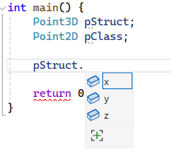
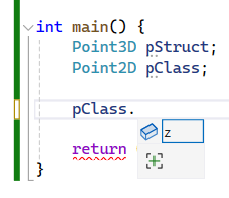
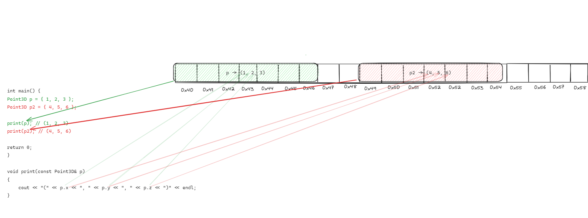
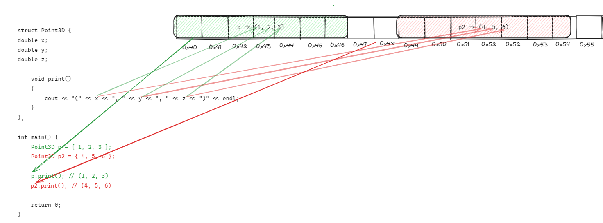
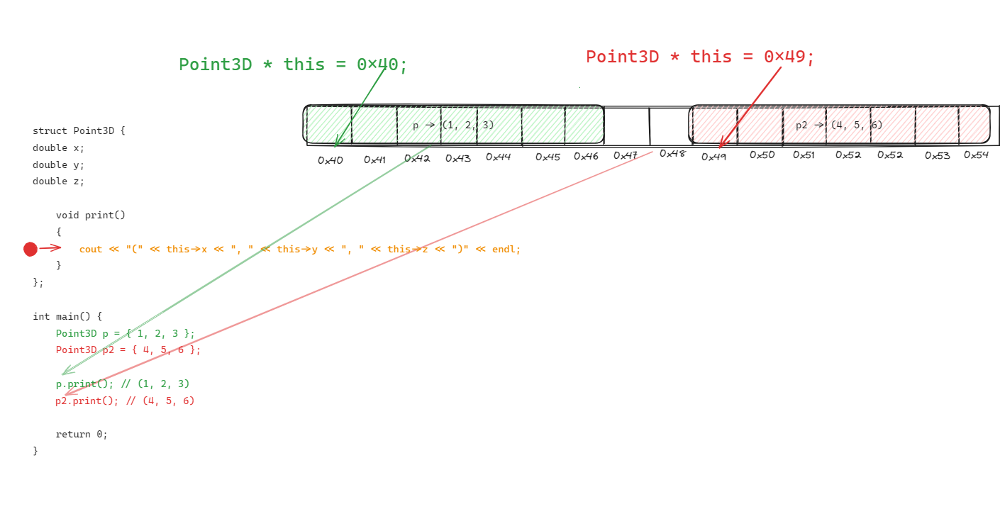

# Класове - идея, видимост. Членове. Декларация и дефиниция. Класове и обекти - жизнен цикъл. Конструктори и деструктори. Инициализация. Изключения.

# Задачи

За всички задачи, ако не е изписана изрично дължината на полета, които съдържат текст, се приема че са максимално `255` символа.
При полета, които са отбелязани с произволна дължина, да се използва динамична памет.

Някои от задачите имат въпроси към тях, които имат цел подобряване на разбирането.

## 1. Декларация на клас. Модификатори за видимост при полетата.

Създайте клас `Book`, който съдържа три член-променливи: `title` (заглавие), `author` (автор) и `year` (година на издаване). Всички член-променливи трябва да бъдат `private`. Добавете конструктор, който позволява създаване на обект от тип `Book` и инициализира и трите полета със стойности подадени от потребителя. Добавете публичен метод `printDetails()`, който отпечатва детайли за книгата.

<details>
<summary>Отговор. Моля, първо реши задачата преди да гледаш решението.</summary>

<small><b>Пример 1: Решение на задача 1 чрез новата концепция `class`</b><small>

```c++
#include <iostream>
#include <cstring>

using std::cin;
using std::cout;
using std::endl;

const unsigned int MAX_STRING_LENGTH = 255;
const unsigned int T_ZERO_LENGTH = 1;

class Book {
private:
    char title[MAX_STRING_LENGTH + T_ZERO_LENGTH];
    char author[MAX_STRING_LENGTH + T_ZERO_LENGTH];
    int publishYear;

public:
    Book(const char * title, const char * author, int publishYear) {
        strncpy(this->title, title, MAX_STRING_LENGTH);
        this->title[MAX_STRING_LENGTH] = '\0';
        
        strncpy(this->author, author, MAX_STRING_LENGTH);
        this->author[MAX_STRING_LENGTH] = '\0';
        
        this->publishYear = publishYear;
    }
    
    void printDetailsToConsole() {
        cout << "Title: "<< title << endl;
        cout << "Author: " << author << endl;
        cout << "Year of publishing: " << publishYear << endl;
        cout << endl;
    }
};

int main() {
    Book childrenBook = Book("The neverending story", "Michael Ende", 1979);
    
    childrenBook.printDetailsToConsole();
    
    return 0;
}
```

</details>

---

### Каква е разликата между структура и клас?

#### public access modifier
Всъщност когато създадем структура по следния начин:

```c++
struct Point3D {
	double x;
	double y;
	double z;
};
```

C++ я вижда по следния начин:
```c++
struct Point3D {
public: 
	double x;
	double y;
	double z;
};
```

`public:` прави следното: Всички под него е публично достъпно, което означава, че ако създадем обект от тип `Point3D`, можем да вземаме или променяме стойността.
Тоест, по подразбиране полетата и методите на структурите са публични - достъпни от всеки, които има обект от тази структура.



#### private access modifier

От друга страна, когато направим клас:

```c++
class Point2D {
	double x;
	double y;
};
```

В C++, класовете по подразбиране не дават достъп полетата и методите си.
```c++
class Point2D {
private:
	double x;
	double y;
};
```
Например, ако използваме оператор точка, нямаме достъп нито до `x`, нито до `y`.


`private:` прави полетата достъпни докато дефинираме класа, но не и когато създадем обект от него.


#### combining private and public access modifiers
Целта на това е да имаме контрол над това, как искаме нашият клас (или структура) да бъдат използвани. 

Можем да комбинираме `private` и `public` по следния начин:

```c++
class Point2D {
private:
	double x;
	double y;

public:
	double z;
};

```

Ефектът е, че обекти от тип `Point2D`, имат достъп само до `z` тъй като само то е публично.


В програмирането `public` и `private` се наричат модификатори за достъп (access modifiers) - контролират достъпа до дадени данни.

В крайна сметка единствената истинска разлика между структурите и класовете е следната - по подразбиране, полетата и методите на структурите са `public`, а на класовете `private`.

Семантиката обаче е напълно различна, общоприето правило при програмистите в индустрията е, че структурите са просто преносителни на данни, т.е. обикновено имат само полета и групират дадени данни. От друга страна класовете групират данни и операции върху тези данни. С времето ще стане ясно.
### Какво е клас?

<details>
<summary>Отговор. Моля, първо реши задачата преди да гледаш решението.</summary>
Класовете обединяват данни и операциите върху тези данни.
В случая данните са (заглавие, автор, година), а операциите върху тях са (инициализация, принтиране).

Ако трябваше да решим тази задача със знанията, които имаме досега, т.е. структури и функции, би изглеждала така:

<details>
<summary>Решение на задача 1 чрез структури и функции</summary>

<small><b>Пример 2: Решение на задача 1 чрез познатия ни материал досега - структури и функции </b><small>

```c++
#include <iostream>
#include <cstring>

using std::cin;
using std::cout;
using std::endl;

const unsigned int MAX_STRING_LENGTH = 255;
const unsigned int T_ZERO_LENGTH = 1;

struct Book {
    char title[MAX_STRING_LENGTH + T_ZERO_LENGTH];
    char author[MAX_STRING_LENGTH + T_ZERO_LENGTH];
    int publishYear;
};

void createBook(Book& book, const char * title, const char * author, int publishYear) {
        strncpy(book.title, title, MAX_STRING_LENGTH);
        book.title[MAX_STRING_LENGTH] = '\0';
        
        strncpy(book.author, author, MAX_STRING_LENGTH);
        book.author[MAX_STRING_LENGTH] = '\0';
        
        book.publishYear = publishYear;
    }
    
    void printBookDetailsToConsole(const Book& book) {
        cout << "Title: "<< book.title << endl;
        cout << "Author: " << book.author << endl;
        cout << "Year of publishing: " << book.publishYear << endl;
        cout << endl;
    }


int main() {
    Book childrenBook;
    createBook(childrenBook, "The neverending story", "Michael Ende", 1979);
    
    printBookDetailsToConsole(childrenBook);
    
    return 0;
}


```

</details>

Главният проблем на този код е, че данните (`struct Book`) и операциите, които работят с тях (`createBook`, `printBookDetailsToConsole`) са разделени. Ако имахме още 10 операции с книги, щяхме да имаме още 10 подобни функции. Това става много проблемно за четенето и разбирането на кода, особено когато добавим и още 10 структури, които със себе си носят още функции.

Класовете ни позволят да съберем тези данни, да ги скрием от външният свят и операциите върху тях в едно.

</details>


--- 

### Какво е метод?

<details>
<summary>Отговор. Моля, първо реши задачата преди да гледаш решението.</summary>

Функциите са блок от код, които имат имена и изпълняват дадена задача. 

Те са независими, т.е. можем да ги използваме директно. От друга страна, например полетата на една структура са недостъпни без да имаме обект на тази структура.

Методите комбинират функциите и полетата, те са фукнции дефинирани в контекста на дадена структура или клас. Не могат да бъдат използвани без да има инстанция от дадената структура или клас.

На много прост език - ако една функция е дефинирана между отварящата и затваряща скобка на дадена структура или клас, то тя е **метод**(англ: method).
Ако е дефинарана самостоятелна, то тя е **функция**. 

Нека илюстрираме разликата между двете със следния пример.
<small><b>Пример 3: `struct Point3D` + функция `print` </b><small>

```c++
#include <iostream>
#include <cstring>

using std::cin;
using std::cout;
using std::endl;

struct Point3D {
	double x;
	double y;
	double z;
};

void print(const Point3D& p)
{
	cout << "(" << p.x << ", " << p.y << ", " << p.z << ")" << endl;
}

int main() {
	Point3D p = { 1, 2, 3 };
	Point3D p2 = { 4, 5, 6 };

	print(p); // (1, 2, 3)
	print(p2); // (4, 5, 6)

	return 0;
}
```
<small><b>Пример 4: Визуализация - създаване на обекти и извикване на функцията `print()` </b><small>



Ако искаме да превърнем функцията `print` в метод, просто я преместваме самата структура(или клас).

<small><b>Пример 5: `struct Point3D` + метод `print` </b><small>

```c++
#include <iostream>
#include <cstring>

using std::cin;
using std::cout;
using std::endl;

struct Point3D {
	double x;
	double y;
	double z;

	// 1. Move print() function in to the context of Point3D.
	// 2. Remove input parameter const Point3D& p. Since we're in the context of the structure, we have direct access to its fields.
	void print()
	{
		cout << "(" << x << ", " << y << ", " << z << ")" << endl;
	}
};


int main() {
	Point3D p = { 1, 2, 3 };
	Point3D p2 = { 4, 5, 6 };

	// instead of calling a function and passsing the point object -> print(p), access the print method
	p.print(); // (1, 2, 3)
	p2.print(); // (4, 5, 6)

	return 0;
}

```

<small><b>Пример 6: Визуализация - създаване на обекти и извикване на **метод** `print()` </b><small>


</details>


--- 

### С какво ни помагат методите?

<details>
<summary>Отговор. Моля, първо реши задачата преди да гледаш решението.</summary>

1. В контекстът на структурите и класове са много удобни. Те ни дават достъп до полетата на структурите или класовете. 
Аргументите, които досега трябваше да подаваме като параметър `void print(const Point3D& p)`, вече са ненужни, тъй като сме в контекстът на самата структура или клас, имаме просто `void print()`, където методът има достъп до полетата, които в предишния пример биха принадлежали на `const Point3D& p`.

2. Извикването е по-интуитивно `print(p)` срещу `p.print()` при методите. Това става доста по-ясно когато имаме много аргументи.
Например `p.distanceTo(p2)` е по-ясно от `distanceTo(p, p2)`.

3. При класовете, методите имат достъп по `private` полетата, които по-принцип са недостъпни. Надолу има въпрос, които изяснява тематиката около `private`.
</details>


### Какво е `this`?

<details>
<summary>Отговор. Моля, първо реши задачата преди да гледаш решението.</summary>
Указател към текущата инстанция на класа. Има различни приложение, за момента едно от тях е, че ни позволява да имаме методи, които имат параметри с имена, които съвпадат с имената на полетата на структурата и класа.

Разгледайте разликите между тези 2 примера на `print()`. Всъщност няма такива.

<small><b>Пример xxxx: ??? </b><small>

```c++
#include <iostream>
#include <cstring>

using std::cin;
using std::cout;
using std::endl;

struct Point3D {
	double x;
	double y;
	double z;

	void print()
	{
		// 1. When p.print() is called, this->x = 1, this->y = 2, this->z = 3.
		// 2. When p2.print() is called, this->x = 4, this->y = 5, this->z = 6.
		cout << "(" << this->x << ", " << this->y << ", " << this->z << ")" << endl;
	}

    // 3. Completely same as the print() above. If we skip used "this->" it is implicitly added by the compiler.
    void print()
	{
		cout << "(" << x << ", " << y << ", " << z << ")" << endl;
	}

    // 4. Enables defining a second "double z" for methods, as we can reference our field "double z" through "this->z".
	bool hasEqualZ(double z)
	{
		return this->z == z;
	}
};


int main() {
	Point3D p = { 1, 2, 3 };
	Point3D p2 = { 4, 5, 6 };

	p.print(); // (1, 2, 3)
	p2.print(); // (4, 5, 6)

	return 0;
}

```

В случая, ако сложим `breakpoint` на `print()` метода, при изпълнението на `p.print()`, `this` ще сочи към адресът `0x40` и съответно `this->x == 1`.
При изпълнението на `p2.print()`, `this` ще сочи към `0x49` и `this->x == 4`

<small><b>Пример xxxx: ??? </b><small>


</details>

--- 

### За какво използваме класовете?

<details>
<summary>Отговор. Моля, първо реши задачата преди да гледаш решението.</summary>

</details>

--- 

### Какво е `private`?

<details>
<summary>Отговор. Моля, първо реши задачата преди да гледаш решението.</summary>

</details>

--- 
### Защо искаме нещо да е `private`?

<details>
<summary>Отговор. Моля, първо реши задачата преди да гледаш решението.</summary>

</details>

--- 

### Какво е енкапсулация?

<details>
<summary>Отговор. Моля, първо реши задачата преди да гледаш решението.</summary>

</details>

--- 

### Може ли нещо да е различно от `private`?

<details>
<summary>Отговор. Моля, първо реши задачата преди да гледаш решението.</summary>

</details>

--- 
### Какво е конструктор?

<details>
<summary>Отговор. Моля, първо реши задачата преди да гледаш решението.</summary>

</details>

--- 

### Как се използва конструктор?

<details>
<summary>Отговор. Моля, първо реши задачата преди да гледаш решението.</summary>

</details>

--- 
### С какво е полезен конструкторът?

<details>
<summary>Отговор. Моля, първо реши задачата преди да гледаш решението.</summary>

</details>

--- 
### Можем ли да имаме повече от един конструктор?

<details>
<summary>Отговор. Моля, първо реши задачата преди да гледаш решението.</summary>

</details>

--- 
### Какво е жизнен цикъл на обект?

<details>
<summary>Отговор. Моля, първо реши задачата преди да гледаш решението.</summary>

</details>

--- 
### Каква е разликата между структура и клас?

<details>
<summary>Отговор. Моля, първо реши задачата преди да гледаш решението.</summary>

</details>

--- 
### Кога използвам структура? Кога използвам клас?

<details>
<summary>Отговор. Моля, първо реши задачата преди да гледаш решението.</summary>

</details>

--- 
### 

<details>
<summary>Отговор. Моля, първо реши задачата преди да гледаш решението.</summary>

</details>

--- 
###

<details>
<summary>Отговор. Моля, първо реши задачата преди да гледаш решението.</summary>

</details>

--- 

## 1.1 Инстанциране на клас. Промяна на стойностите на полетата.

## 1.1 Методи. Модификатори за видимост при методите.