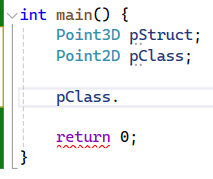
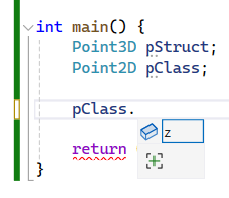
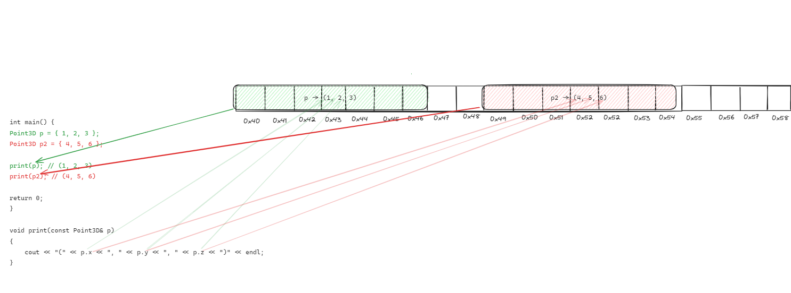
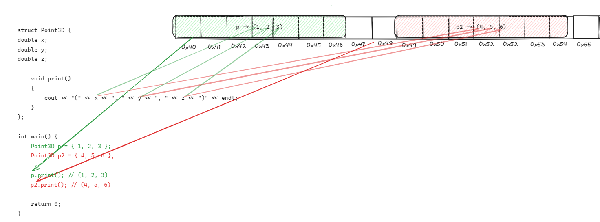
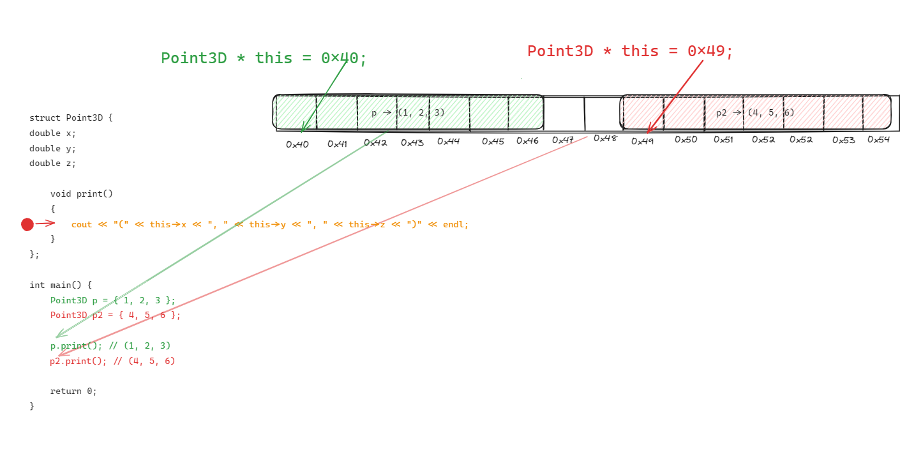
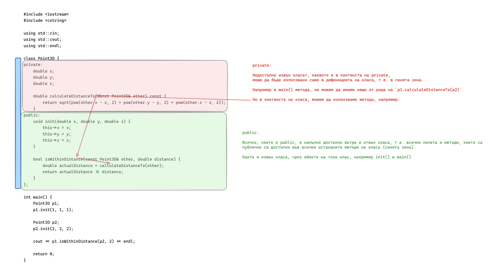

# Класове - идея, видимост. Членове. Декларация и дефиниция. Класове и обекти - жизнен цикъл. Конструктори и деструктори. Инициализация. Изключения.

# Задачи

За всички задачи, ако не е изписана изрично дължината на полета, които съдържат текст, се приема че са максимално `255` символа.
При полета, които са отбелязани с произволна дължина, да се използва динамична памет.

Някои от задачите имат въпроси към тях, които имат цел подобряване на разбирането.

## 1.0 Декларация на клас. Модификатори за видимост при полетата.

Създайте клас `Book`, който съдържа три член-променливи: `title` (заглавие), `author` (автор) и `year` (година на издаване). Всички член-променливи трябва да бъдат `private`. Добавете конструктор, който позволява създаване на обект от тип `Book` и инициализира и трите полета със стойности подадени от потребителя. Добавете публичен метод `printDetails()`, който отпечатва детайли за книгата.

<details>
<summary>Отговор. Моля, първо реши задачата преди да гледаш решението.</summary>

<small><b>Пример 1: Решение на задача 1 чрез новата концепция `class`</b><small>

```c++
#include <iostream>
#include <cstring>

using std::cin;
using std::cout;
using std::endl;

const unsigned int MAX_STRING_LENGTH = 255;
const unsigned int T_ZERO_LENGTH = 1;

class Book {
private:
    char title[MAX_STRING_LENGTH + T_ZERO_LENGTH];
    char author[MAX_STRING_LENGTH + T_ZERO_LENGTH];
    int publishYear;

public:
    Book(const char * title, const char * author, int publishYear) {
        strncpy(this->title, title, MAX_STRING_LENGTH);
        this->title[MAX_STRING_LENGTH] = '\0';
        
        strncpy(this->author, author, MAX_STRING_LENGTH);
        this->author[MAX_STRING_LENGTH] = '\0';
        
        this->publishYear = publishYear;
    }
    
    void printDetailsToConsole() {
        cout << "Title: "<< title << endl;
        cout << "Author: " << author << endl;
        cout << "Year of publishing: " << publishYear << endl;
        cout << endl;
    }
};

int main() {
    Book childrenBook = Book("The neverending story", "Michael Ende", 1979);
    
    childrenBook.printDetailsToConsole();
    
    return 0;
}
```

</details>

---

### Каква е разликата между структура и клас?

<details>
<summary>Отговор. Моля, първо реши задачата преди да гледаш решението.</summary>

#### public access modifier
Всъщност когато създадем структура по следния начин:

```c++
struct Point3D {
	double x;
	double y;
	double z;
};
```

C++ я вижда по следния начин:
```c++
struct Point3D {
public: 
	double x;
	double y;
	double z;
};
```

`public:` прави следното: Всички под него е публично достъпно, което означава, че ако създадем обект от тип `Point3D`, можем да вземаме или променяме стойността.
Тоест, по подразбиране полетата и методите на структурите са публични - достъпни от всеки, които има обект от тази структура.


#### private access modifier

От друга страна, когато направим клас:

```c++
class Point2D {
	double x;
	double y;
};
```

В C++, класовете по подразбиране не дават достъп полетата и методите си.
```c++
class Point2D {
private:
	double x;
	double y;
};
```
Например, ако използваме оператор точка, нямаме достъп нито до `x`, нито до `y`.


`private:` прави полетата достъпни докато дефинираме класа, но не и когато създадем обект от него.


#### combining private and public access modifiers
Целта на това е да имаме контрол над това, как искаме нашият клас (или структура) да бъдат използвани. 

Можем да комбинираме `private` и `public` по следния начин:

```c++
class Point2D {
private:
	double x;
	double y;

public:
	double z;
};

```

Ефектът е, че обекти от тип `Point2D`, имат достъп само до `z` тъй като само то е публично.


В програмирането `public` и `private` се наричат модификатори за достъп (access modifiers) - контролират достъпа до дадени данни.

В крайна сметка единствената истинска разлика между структурите и класовете е следната - по подразбиране, полетата и методите на структурите са `public`, а на класовете `private`.

Семантиката обаче е напълно различна, общоприето правило при програмистите в индустрията е, че структурите са просто преносителни на данни, т.е. обикновено имат само полета и групират дадени данни. От друга страна класовете групират данни и операции върху тези данни. С времето ще стане ясно.

</details>

### Какво е клас?

<details>
<summary>Отговор. Моля, първо реши задачата преди да гледаш решението.</summary>
Класовете обединяват данни и операциите върху тези данни.
В случая данните са (заглавие, автор, година), а операциите върху тях са (инициализация, принтиране).

Ако трябваше да решим тази задача със знанията, които имаме досега, т.е. структури и функции, би изглеждала така:

<details>
<summary>Решение на задача 1 чрез структури и функции</summary>

<small><b>Пример 2: Решение на задача 1 чрез познатия ни материал досега - структури и функции </b><small>

```c++
#include <iostream>
#include <cstring>

using std::cin;
using std::cout;
using std::endl;

const unsigned int MAX_STRING_LENGTH = 255;
const unsigned int T_ZERO_LENGTH = 1;

struct Book {
    char title[MAX_STRING_LENGTH + T_ZERO_LENGTH];
    char author[MAX_STRING_LENGTH + T_ZERO_LENGTH];
    int publishYear;
};

void createBook(Book& book, const char * title, const char * author, int publishYear) {
        strncpy(book.title, title, MAX_STRING_LENGTH);
        book.title[MAX_STRING_LENGTH] = '\0';
        
        strncpy(book.author, author, MAX_STRING_LENGTH);
        book.author[MAX_STRING_LENGTH] = '\0';
        
        book.publishYear = publishYear;
    }
    
    void printBookDetailsToConsole(const Book& book) {
        cout << "Title: "<< book.title << endl;
        cout << "Author: " << book.author << endl;
        cout << "Year of publishing: " << book.publishYear << endl;
        cout << endl;
    }


int main() {
    Book childrenBook;
    createBook(childrenBook, "The neverending story", "Michael Ende", 1979);
    
    printBookDetailsToConsole(childrenBook);
    
    return 0;
}


```

</details>

Главният проблем на този код е, че данните (`struct Book`) и операциите, които работят с тях (`createBook`, `printBookDetailsToConsole`) са разделени. Ако имахме още 10 операции с книги, щяхме да имаме още 10 подобни функции. Това става много проблемно за четенето и разбирането на кода, особено когато добавим и още 10 структури, които със себе си носят още функции.

Класовете ни позволят да съберем тези данни, да ги скрием от външният свят и операциите върху тях в едно.

</details>


--- 

### Какво е метод?

<details>
<summary>Отговор. Моля, първо реши задачата преди да гледаш решението.</summary>

Функциите са блок от код, които имат имена и изпълняват дадена задача. 

Те са независими, т.е. можем да ги използваме директно. От друга страна, например полетата на една структура са недостъпни без да имаме обект на тази структура.

Методите комбинират функциите и полетата, те са фукнции дефинирани в контекста на дадена структура или клас. Не могат да бъдат използвани без да има инстанция от дадената структура или клас.

На много прост език - ако една функция е дефинирана между отварящата и затваряща скобка на дадена структура или клас, то тя е **метод**(англ: method).
Ако е дефинарана самостоятелна, то тя е **функция**. 

Нека илюстрираме разликата между двете със следния пример.
<small><b>Пример 3: `struct Point3D` + функция `print` </b><small>

```c++
#include <iostream>
#include <cstring>

using std::cin;
using std::cout;
using std::endl;

struct Point3D {
	double x;
	double y;
	double z;
};

void print(const Point3D& p)
{
	cout << "(" << p.x << ", " << p.y << ", " << p.z << ")" << endl;
}

int main() {
	Point3D p = { 1, 2, 3 };
	Point3D p2 = { 4, 5, 6 };

	print(p); // (1, 2, 3)
	print(p2); // (4, 5, 6)

	return 0;
}
```
<small><b>Пример 4: Визуализация - създаване на обекти и извикване на функцията `print()` </b><small>



Ако искаме да превърнем функцията `print` в метод, просто я преместваме самата структура(или клас).

<small><b>Пример 5: `struct Point3D` + метод `print` </b><small>

```c++
#include <iostream>
#include <cstring>

using std::cin;
using std::cout;
using std::endl;

struct Point3D {
	double x;
	double y;
	double z;

	// 1. Move print() function in to the context of Point3D.
	// 2. Remove input parameter const Point3D& p. Since we're in the context of the structure, we have direct access to its fields.
	void print()
	{
		cout << "(" << x << ", " << y << ", " << z << ")" << endl;
	}
};


int main() {
	Point3D p = { 1, 2, 3 };
	Point3D p2 = { 4, 5, 6 };

	// instead of calling a function and passsing the point object -> print(p), access the print method
	p.print(); // (1, 2, 3)
	p2.print(); // (4, 5, 6)

	return 0;
}

```

<small><b>Пример 6: Визуализация - създаване на обекти и извикване на **метод** `print()` </b><small>


</details>


--- 

### С какво ни помагат методите?

<details>
<summary>Отговор. Моля, първо реши задачата преди да гледаш решението.</summary>

1. В контекстът на структурите и класове са много удобни. Те ни дават достъп до полетата на структурите или класовете. 
Аргументите, които досега трябваше да подаваме като параметър `void print(const Point3D& p)`, вече са ненужни, тъй като сме в контекстът на самата структура или клас, имаме просто `void print()`, където методът има достъп до полетата, които в предишния пример биха принадлежали на `const Point3D& p`.

2. Извикването е по-интуитивно `print(p)` срещу `p.print()` при методите. Това става доста по-ясно когато имаме много аргументи.
Например `p.distanceTo(p2)` е по-ясно от `distanceTo(p, p2)`.

3. При класовете, методите имат достъп по `private` полетата, които по-принцип са недостъпни. Надолу има въпрос, които изяснява тематиката около `private`.
</details>


### Какво е `this`?

<details>
<summary>Отговор. Моля, първо реши задачата преди да гледаш решението.</summary>
Указател към текущата инстанция на класа. Има различни приложение, за момента едно от тях е, че ни позволява да имаме методи, които имат параметри с имена, които съвпадат с имената на полетата на структурата и класа.

Разгледайте разликите между тези 2 примера на `print()`. Всъщност няма такива.

<small><b>Пример xxxx: ??? </b><small>

```c++
#include <iostream>
#include <cstring>

using std::cin;
using std::cout;
using std::endl;

struct Point3D {
	double x;
	double y;
	double z;

	void print()
	{
		// 1. When p.print() is called, this->x = 1, this->y = 2, this->z = 3.
		// 2. When p2.print() is called, this->x = 4, this->y = 5, this->z = 6.
		cout << "(" << this->x << ", " << this->y << ", " << this->z << ")" << endl;
	}

    // 3. Completely same as the print() above. If we skip used "this->" it is implicitly added by the compiler.
    void print()
	{
		cout << "(" << x << ", " << y << ", " << z << ")" << endl;
	}

    // 4. Enables defining a second "double z" for methods, as we can reference our field "double z" through "this->z".
	bool hasEqualZ(double z)
	{
		return this->z == z;
	}
};


int main() {
	Point3D p = { 1, 2, 3 };
	Point3D p2 = { 4, 5, 6 };

	p.print(); // (1, 2, 3)
	p2.print(); // (4, 5, 6)

	return 0;
}

```

В случая, ако сложим `breakpoint` на `print()` метода,

1. При изпълнението на `p.print()`, `this` ще сочи към `0x40` и `this->x == 1`.
2. При изпълнението на `p2.print()`, `this` ще сочи към `0x49` и `this->x == 4`

<small><b>Пример xxxx: ??? </b><small>


</details>

--- 


### Какво е `private`? Има ли нещо друго освен `private`?

<details>
<summary>Отговор. Моля, първо реши задачата преди да гледаш решението.</summary>

Даден код в един клас, можем да разделим на 2 части, `public` и `private`.
`public` кодът е това, до което има достъп потребителя на този код, ако вземем една пералня, `public` частта от нея биха били бутоните, които ни предлагат различни функции за пране на нашите дрехи.

От друга страна `private` е код, до който потребителя няма достъп, той е съдържа вътрешната логика и всякакви подпомагащи функции, които са нужни за да се свърши очакваната работа. В метафората за пералнята, `private` са всички други неща, които има и прави пералнята, за да изпълни функционалностите на публичната част.

В примера, публичната функционалност на класа `Point3D` е да го инициализираме чрез `init()` и да проверим дали дадена точна е на по-малко разтояние от даденото с метода `isWithinDistance()`.

За да проверим дали дадена точна е на по-малко дистанция от очакваната има нужда да пресметнем дистанцията между двете точки, това правим чрез метода `calculateDistanceTo`, който е `private`, т.е. можем да го използваме във всички `public` и `private` методи, но не можем да го използваме извън класа, т.е чрез обект от този клас.

Защо? Защото така сме решили. Когато получим проблем, който трябва да решим, ние моделираме решение, в което ще участвам много различни класове, много важна част от решението е да преценим какви класове ще имаме и какви ще публичните им методи, защото тези класове ще взаимодействат един с друг, точно чрез публичните си методи, ще получават данни от другите класове чрез тях и ще връщат данни да другите класове чрез тях. `private` методите главно ще отговарят за изпълнението на ключовата част от работата, която не е важна за останалите класове, те се интересуват само от резултата.

Следният пример илюстрира разделението на `public` и `private`:

<small><b>Пример xxxx: ??? </b><small>

```c++
#include <iostream>
#include <cstring>

using std::cin;
using std::cout;
using std::endl;


class Point3D {
private:
    double x;
    double y;
    double z;
    
    double calculateDistanceTo(const Point3D& other) const {
        return sqrt(pow(other.x - x, 2) + pow(other.y - y, 2) + pow(other.z - z, 2));
    }
public:
    void init(double x, double y, double z) {
        this->x = x;
        this->y = y;
        this->z = z;
    }
    
    bool isWithinDistance(const Point3D& other, double distance) {
        double actualDistance = calculateDistanceTo(other);
        return actualDistance <= distance;
    }
};

int main() {
    Point3D p1;
    p1.init(1, 1, 1);
    
    Point3D p2;
    p2.init(2, 2, 2);
    
    cout << p1.isWithinDistance(p2, 2) << endl;
    
    return 0;
}

```

<small><b>Пример xxxx: ??? </b><small>


</details>

---

### Защо искаме нещо да е `private`?

<details>
<summary>Отговор. Моля, първо реши задачата преди да гледаш решението.</summary>
Една от основните принципи на ООП-то е енкапсулация(`encapsulation`), виж надолу.

`private` ни дава два плюса:
1. **Защита на данните** - когато нещо е `private`, то не може да бъде променено отвън класа, т.е. имаме пълен контрол над валидността на нашите данни
2. **Скриване на имплементация** - Дадена калкулация, може да е хиляди редове код, всичко това можем да скрием в `private` методи и да имаме само 1 публичен, които връща резултата. Това безкрайно много опростява използването на тази функционалност.

</details>

--- 

### Защо искаме нещо да е `public`?

<details>
<summary>Отговор. Моля, първо реши задачата преди да гледаш решението.</summary>

`public` и `private` се допълват взаимно, `public` ни дава:
1. **Контрол над формата на класа спрямо външния свят** - имаме пълния контрол как искаме да изглежда това, което останалите класове виждат и използват. Как се казват методите, какво връщат, какви параметри приемат, дали дадени полета са достъпни или не
2. **Леснота при употреба** - тъй като за външния свят само и единствено публичните методи и полета са видими, то тъй като сме скрили всичко сложно вътре в класа, на външния свят показваме най-лесната за разбиране част, която прави този клас полезен.

</details>

--- 

### Какво е енкапсулация?

<details>
<summary>Отговор. Моля, първо реши задачата преди да гледаш решението.</summary>
Енкапсулацията е абстрактната идея за групирането на данните и операциите върху тях в едно.
Тази абстрактна идея приложена в ООП-то са **класовете**:
1. Данните са `public` и `private` полетата на класа
2. операциите върху тях са `public` и `private` методите на класа

Целите на енкапсулирането на данни и операциите върху тях са самите цели на `private access modifier`-a:
1. **Защита на данните** - ако пишем банков софтуер, не искаме да може се теглят пари от банкови сметки с отрицателен баланс
2. **Скриване на сложността** - не искаме потребителят да изпълнява 15 метода, за да свърши една операция, вместо това имаме 1 публичен метод, който извиква 15-те `private` метода.

Ползите от енкапсулацията са:
1. **Подробена разделеност на кода** - всеки клас прави едно нещо и го прави добре, сложността е скрита в него и той взаимодейства чрез своя `public interface` (публичен интерфейс) с останалите класове по най-лесния начин.
2. **По-голяма гъвкавост и поддръжка** - тъй като другите класове имат достъп само до публичния интерфейс на нашия код, стига да не го променяме, можем да променяме колкото е нужно в `private` частта.
3. **Подобрена сигурност на данните** - Ако не можем да променим нещо, няма да го променим по погрешка или дори и да искаме.

В крайна сметка това е абстракна идея, която прилагаме на практика, чрез пособите на C++ - класове, полета, методи, модификатори за достъп + нашата нагласа и моделиране на проблемите, с които се сблъскваме.

</details>

--- 

### Какво е публичен интерфейс?

<details>
<summary>Отговор. Моля, първо реши задачата преди да гледаш решението.</summary>
Следните отговори на този въпрос са еквивалентни:
1. Това, което вижда светът, която използва вашия клас
2. Публичните методи и полета
3. Бутоните на пералнята

Защо?
Класът се разделя на `public` и `private` част спрямо принципът енкапсулация. `public` е частта на класа, която e достъпва от пограмистите които използват този клас. В случая ние сме авторите и потребителите на класовете, които използваме. Друго име за публичната част на един клас е `public interface`(това не е ключова дума в c++, а общ език на програмстите).

</details>

--- 


### Какво е конструктор?

<details>
<summary>Отговор. Моля, първо реши задачата преди да гледаш решението.</summary>
Конструкторът е специален метод в обектно-ориентираното програмиране, който се извиква автоматично при създаването на обект от даден клас. Той инициализира обекта и задава начални стойности на член-променливите му.

**Пример:**

```cpp
class Book {
public:
    char title[256]; // 255 + 1 for terminating zero
    char author[256];

    Book() {
        title[0] = '\0'; // Empty string
        author[0] = '\0';
    }
};
```
Този пример показва конструктор по подразбиране за клас Book, който инициализира title и author като празни низове.

</details>

--- 

### Как се използва конструктор?
<details>
<summary>Отговор. Моля, първо реши задачата преди да гледаш решението.</summary>
Конструкторът се използва при създаването на нов обект от даден клас. Синтаксисът за извикване на конструктор е същият като този за деклариране на променлива от съответния тип, като може да включва и аргументи, ако конструкторът ги изисква.
Пример:

```c++
class Book {
public:
    char title[256];
    char author[256];

    Book(const char* bookTitle, const char* bookAuthor) {
        strncpy(title, bookTitle, 255);
        title[255] = '\0'; // Gurantee correct string termination.
        strncpy(author, bookAuthor, 255);
        author[255] = '\0';
    }
};

int main() {
    Book myBook("Atomic Habits", "James Clear"); // <----
}
```

Този пример илюстрира конструктор на клас Book, който приема два аргумента - заглавието и автора на книгата, и използва strncpy за да копира стойностите в член-променливите.

</details>
---

### С какво е полезен конструкторът?
<details>
<summary>Отговор. Моля, първо реши задачата преди да гледаш решението.</summary>
Конструкторът е полезен за инициализация на обекти при тяхното създаване. Той гарантира, че обектът започва живота си във валидно състояние, като зададе начални стойности на член-променливите му.
Пример:

```c++
class Book {
public:
    char title[256];
    char author[256];
    
    Book(const char* bookTitle, const char* bookAuthor) {
        strncpy(title, bookTitle, 255);
        title[255] = '\0'; 
        strncpy(author, bookAuthor, 255);
        author[255] = '\0';
    }
};

int main() {
    Book myBook("Atomic Habits", "James Clear");
}
```

---

### Можем ли да имаме повече от един конструктор?

<details>
<summary>Отговор. Моля, първо реши задачата преди да гледаш решението.</summary>
Да, в C++ е възможно един клас да има повече от един конструктор. Това позволява обектите да бъдат инициализирани по различни начини в зависимост от предоставената информация при създаването им.

**Пример:**

```cpp
class Book {
public:
    char title[256];
    char author[256];
    int year;

    // Default constructor.
    Book() {
        title[0] = '\0';
        author[0] = '\0';
        year = 0; 
    }

    // Parameterized constructor.
    Book(const char* bookTitle, const char* bookAuthor, int bookYear) {
        strncpy(title, bookTitle, 255);
        title[255] = '\0';
        strncpy(author, bookAuthor, 255);
        author[255] = '\0';
        year = bookYear; 
    }
};

```
В този пример, класът Book има два конструктора: един по подразбиране без параметри и един параметричен, който приема заглавие, автор и година.

</details>

### Какво е жизнен цикъл на обект?
<details>
<summary>Отговор. Моля, първо реши задачата преди да гледаш решението.</summary>
Жизненият цикъл на обект в C++ започва, когато обектът е създаден чрез извикване на неговия конструктор, и продължава докато обектът е достъпен в програмата. Обектът престава да съществува, когато неговият жизнен цикъл приключи - например, когато излезе от областта си на видимост или когато експлицитно се освободи паметта, заделена за него в случай на динамична алокация.
Пример:

```c++	
void createBook() {
    Book book("Под игото", "Иван Вазов", 1888); // Жизненият цикъл на book започва тук
} // Жизненият цикъл на book приключва тук, когато излезе от областта си на видимост

int main() {
    createBook();
    // В този момент book вече не съществува
}

```
Този пример илюстрира жизнения цикъл на обект `book` в рамките на функцията `createBook`.

</details>
---

### Кога използвам структура? Кога използвам клас?
<details>
<summary>Отговор. Моля, първо реши задачата преди да гледаш решението.</summary>
В C++ структурите (`struct`) и класовете (`class`) са много подобни и често могат да се използват взаимозаменяемо. Основната разлика между тях е в стандартните нива на достъп: член-променливите и методите в `struct` са публични (`public`) по подразбиране, докато в `class` са частни (`private`) по подразбиране.
**Използвайте struct, ако:**

Искате да групирате данни без да добавяте значителна функционалност (методи) към тях.
Имате нужда от проста структура данни с публичен достъп до членовете си.

```c++
struct Point {
    int x, y; // Публичен достъп по подразбиране
};

int main() {
    Point p = {1, 2};
    // Директен достъп до член-променливите на структурата
    std::cout << p.x << ", " << p.y << std::endl;
}
```

Използвайте `class`, ако:

Имате нужда от по-сложна структура с член-данни и член-функции (методи), които да капсулирате (скриете) от външния свят.
Искате да контролирате достъпа до членовете на класа чрез модификатори за достъп (public, protected, private).

```c++
class Book {
private:
    char title[256];
    char author[256];
    int year;

public:
    Book(const char* t, const char* a, int y) {
        strncpy(title, t, 255);
        title[255] = '\0';
        strncpy(author, a, 255);
        author[255] = '\0';
        year = y;
    }
    
    void print() {
        std::cout << title << " от " << author << ", " << year << std::endl;
    }
};

int main() {
    Book book("Под игото", "Иван Вазов", 1888);
    book.print(); // Контролиран достъп до член-функциите на класа
}
```

</details>

---

### За какво използваме класовете?
<details>
<summary>Отговор. Моля, първо реши задачата преди да гледаш решението.</summary>
Класовете се използват за създаване на сложни структури данни, които капсулират данни и функционалност. Те позволяват да се моделират реални или абстрактни обекти от живота, като се групират свързани данни (член-променливи) и операции над тези данни (методи) в един логически обект. Класовете са основен компонент на обектно-ориентираното програмиране и позволяват на програмистите да създават добре разделени, повторно използваеми и лесни за поддръжка програми.

Пример:

```c++
class Car {
private:
    char brand[50];
    int year;
    double price;

public:
    Car(const char* b, int y, double p) : year(y), price(p) {
        strncpy(brand, b, 49);
        brand[49] = '\0';
    }
    
    void displayInfo() {
        std::cout << "Brand: " << brand << ", Year: " << year << ", Price: " << price << "$." << std::endl;
    }
};

int main() {
    Car myCar("Toyota", 2020, 30000);
    myCar.displayInfo();
}
```

Този пример демонстрира как класът `Car` може да бъде използван за моделиране на автомобили, като съчетава данни за марка, година на производство и цена в един обект, който предоставя метод за показване на тази информация.

</details>
--- 

## 1.1 Инстанциране на клас. Промяна на стойностите на полетата (setters)
Модифицирайте клас `Book` като добавите публични методи за задаване на нови стойности на полетата `title`, `author` и `year`. Имената на методите трябва да бъдат `setTitle`, `setAuthor` и `setYear`. След това, във функция `main()`, създайте обект от тип `Book`, задайте му начални стойности чрез конструктора, променете стойностите на неговите полета с новосъздадените методи и отпечатайте новите детайли за книгата.

## Задача 1.2 Добавяне на валидация при промяна на полета
Добавете прости проверки в методите `setTitle`, `setAuthor` и `setYear` в класа `Book`, за да осигурите, че:

`title` и `author` не са празни низове.
`year` е по-голяма от 0.

Ако стойностите не отговарят на тези условия, методите не трябва да променят съответните полета. Във функция `main()`, тествайте тези проверки като опитате да зададете невалидни стойности на полетата на обект от тип `Book` и след това отпечатайте детайлите за книгата, за да потвърдите, че промените не са приложени.

## Задача 1.3 Добавяне на методи за достъп до стойностите на полетата (getters)
Разширете класа `Book`, като добавите публични методи, които позволяват достъп до стойностите на полетата `title`, `author` и `year`. Имената на тези методи трябва да бъдат `getTitle`, `getAuthor` и `getYear`. Във функция `main()`, създайте обект от тип `Book`, задайте му стойности, използвайте новите методи за достъп до стойностите на полетата и отпечатайте резултатите на конзолата.

## Задача 1.4 Добавяне на конструктор по подразбиране
Добавете конструктор по подразбиране в класа `Book`, който инициализира `title` и `author` с празен низ, а `year` с 0. Модифицирайте функцията `main()`, така че да създадете обект от тип `Book` без да подавате аргументи на конструктора. Използвайте метода `printDetailsToConsole()`, за да отпечатате стойностите на полетата на този обект.

## Задача 1.5 Добавяне на копиращ конструктор
Добавете копиращ конструктор в класа `Book`, който позволява създаването на нов обект като копие на вече съществуващ. Този конструктор трябва да копира стойностите на `title`, `author` и year от съществуващия обект към новия. Във функцията `main()`, създайте обект от тип `Book`, инициализирайте го с конструктора, и след това използвайте копиращия конструктор, за да създадете копие на този обект. Отпечатайте детайлите за двете книги, за да проверите дали копирането е успешно.

## Задача 1.6 Добавяне на деструктор
Добавете деструктор в класа `Book`. Въпреки че в този пример деструкторът няма да извършва реална работа (тъй като не се използва динамична памет), включете изписване на съобщение до конзолата, което индикира, че деструкторът е извикан. Това ще ви помогне да наблюдавате кога точно обектите от тип Book са унищожени. Тествайте това в `main()` като създадете и унищожите обект от тип `Book`.

## Задача 1.7 Работа с динамична памет
Модифицирайте класа `Book` така, че `title` и `author` да се съхраняват като указатели към `char`, алокирани динамично. Променете конструктора, копиращия конструктор и деструктора, така че да управляват правилно динамичната памет (копиране на низове и освобождаване на ресурси). Също така, модифицирайте методите `setTitle` и `setAuthor`, за да работят с динамична памет. В `main()`, демонстрирайте създаването, копирането и унищожаването на обекти от тип `Book`, които използват динамична памет.

## Задача 1.8 Използване на списък с инициализатори
Добавете конструктор в класа `Book`, който използва списък с инициализатори за членовете, вместо да ги инициализира в тялото на конструктора. Това е по-ефективен начин за инициализация на член-данните, особено когато работим с комплексни типове. Примерите включват конструктор, който приема стойности за `title`, `author` и `year`, и ги задава директно чрез списъка с инициализатори. Покажете как се използва този конструктор в `main()`.

## Задача 1.9 Реализация на оператор за присвояване
Реализирайте оператора за присвояване в класа `Book`, като се уверите, че той коректно копира стойностите на всички полета от един обект в друг, управлявайки динамичната памет адекватно. Това включва проверка за самоприсвояване и освобождаване на старата памет преди копирането на новата. В `main()`, демонстрирайте присвояването на един обект от тип `Book` на друг и проверете дали присвояването е извършено коректно.

## Задача 1.10 Работа с масив от обекти Book
Създайте масив от обекти `Book`. Инициализирайте всеки елемент на масива с различни стойности, като използвате конструктора с параметри, който сте дефинирали по-рано. След това, използвайте цикъл, за да отпечатате детайлите на всяка книга в масива. Това ще ви позволи да демонстрирате уменията си за работа с масиви от обекти и манипулирането им.

## Задача 1.11 Реализация на оператор << за класа Book
Реализирайте оператора за изход `<<` за класа `Book`, така че да може да отпечатате обект от тип `Book` директно към стандартния изход, използвайки `std::cout`. Това включва дефиниране на приятелска функция в класа, която приема `std::ostream&` и обект от тип `Book`, и изписва детайлите за книгата. Тестовете в `main()` трябва да демонстрират тази функционалност.

## Задача 1.12: Презаписване на оператора >> за класа Book

Добавете функционалност към класа `Book`, която позволява обектите от този тип да бъдат четени от стандартния вход (или друг поток вход), използвайки оператора `>>`. Трябва да дефинирате приятелска функция към класа, която презаписва оператора `>>`. Тази функция трябва да прочете заглавието, автора и годината на издаване на книгата, и да зададе прочетените стойности на подадения като аргумент обект от тип `Book`.

`friend std::istream& operator>>(std::istream& in, Book& book);`

Във функцията `main()`, демонстрирайте четенето на информация за една книга от стандартния вход, използвайки оператора `>>`, и след това отпечатайте информацията за книгата, за да потвърдите, че данните са били успешно прочетени и зададени на обекта.

## Задача 2.1: Дефиниране на класа BookStore

Създайте клас `BookStore`, който съдържа масив от обекти `Book`. Включете следните функционалности:

Конструктор по подразбиране, който инициализира празен магазин за книги.
Метод за добавяне на книга в магазина.
Метод за премахване на книга от магазина по заглавие и автор.
Метод за отпечатване на всички книги в магазина.

## Задача 2.2: Реализация на методи за BookStore

Реализирайте методите дефинирани в задача 2.1. Уверете се, че методът за добавяне правилно вмъква нови книги в масива, а методът за премахване изтрива съответната книга, ако тя съществува в магазина. Методът за отпечатване трябва да показва детайлна информация за всяка книга в магазина.

## Задача 2.3: Сортиране на книгите в BookStore

Добавете функционалност в класа `BookStore`, която позволява сортирането на книгите по година на издаване във възходящ ред. Можете да използвате вградени алгоритми за сортиране от стандартната библиотека на C++. Демонстрирайте тази функционалност в `main()`, като добавите няколко книги в магазина и след това отпечатате списъка с книги след сортирането.

## Задача 2.4: Търсене на книга в BookStore

Имплементирайте метод в класа `BookStore`, който позволява търсенето на книга по заглавие и автор. Методът трябва да връща индекса на книгата в масива, ако тя е намерена, или `-1`, ако книгата не съществува в магазина. Тествайте този метод в `main()`, като търсите за конкретна книга.

## Задача 2.5: Запазване и зареждане на BookStore от файл

Разширете класа `BookStore` с методи за запазване на целия магазин за книги в текстов файл и зареждане от такъв файл. Методите save и load трябва да записват и съответно четат всички книги от магазина, използвайки файлов поток. Демонстрирайте тези методи в `main()`, като създадете `BookStore`, добавите няколко книги, запазите магазина в файл, след това заредите магазина от същия файл и отпечатате съдържанието, за да потвърдите, че всички операции са изпълнени успешно.